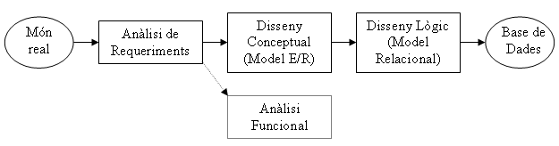

# 1. Introducción

<!--
El **Modelo Entidad-Relación** (**M E/R**) es un modelo de alto nivel, que nos
permitirá representar el mundo que queremos con un lenguaje, una estructura más
cercana a nosotros. Lo utilizaremos dentro de todo el proceso de creación de la Base
de Datos, que consistirá en:

  * A partir de la realidad, estudiarla (investigando, entrevistando a los usuarios, ...) y hacer el **Análisis de Requerimientos**, es decir, qué se quiere. El resultado será un conjunto de requerimientos redactados de forma concisa. 

  

  * A partir del Análisis de Requerimientos, diseñar el Esquema Conceptual de la Base de Datos con un modelo de alto nivel (el **Modelo E/R**). 

  

  * Traducir el esquema conceptual, es decir el diagrama E/R, al Modelo Relacional, obteniendo el Esquema Lógico.
  

  * Implementar el esquema lógico en un SGBD comercial. Añadir las cosas necesarias (índices, retocar campos, ...) para completar el esquema físico, así como las vistas para todos los usuarios (esquema externo). 

  
Un esquema de todo el proceso sería el siguiente:

En realidad, en sistemas grandes, no podemos separar el análisis de los datos del
análisis de los procesos a hacer con los datos. Entonces, paralelo al diseño
conceptual, es decir, después del análisis de requerimientos iría el Análisis
Funcional (línea discontinua), encargado de ver qué procesos generales
son necesarios en el sistema. Nosotros no hilaremos tan fino.

En el Modelo E/R estudiaremos las entidades u objetos de nuestro universo, nuestra
realidad, y las relaciones que habrá entre las distintas entidades.

El Modelo E/R lo propuso Peter P. Chen en 1976. Posteriormente muchos autores
aportaron más cosas, creando el llamado Modelo E/R Extendido (M EE/R), aunque
en realidad hay toda una gama de modelos extendidos.

-->

# Introducción al Modelo Entidad-Relación

El **Modelo Entidad-Relación (E/R)** es un modelo de alto nivel utilizado para diseñar bases de datos de forma visual y cercana a la realidad.

Nos permite representar:

- entidades u objetos
- relaciones entre entidades
- reglas y restricciones del sistema

El objetivo es crear un esquema claro antes de implementar la base de datos en un SGBD.

---

## Proceso de creación de una Base de Datos

El diseño de una base de datos suele seguir estas fases:

-   :material-file-document-outline:

    ## 1. Análisis de requerimientos

    Estudiar el problema real:

    - entrevistas
    - investigación
    - necesidades de los usuarios

    El resultado será una lista de requisitos.

-   :material-graph-outline:

    ## 2. Diseño conceptual

    Crear el diagrama E/R mediante el Modelo Entidad-Relación.

-   :material-table-large:

    ## 3. Modelo relacional

    Transformar el diagrama E/R en tablas relacionales.

-   :material-database-cog:

    ## 4. Implementación

    Crear la base de datos en un SGBD y optimizarla.

!!! info "Importante"
    En sistemas grandes, el análisis de datos y el análisis de procesos suelen realizarse de forma paralela.

---

## Origen del Modelo E/R

El Modelo E/R fue propuesto por Peter P. Chen en 1976. Posteriormente aparecieron ampliaciones conocidas como: **Modelo E/R Extendido** que incorporan nuevas características y restricciones.