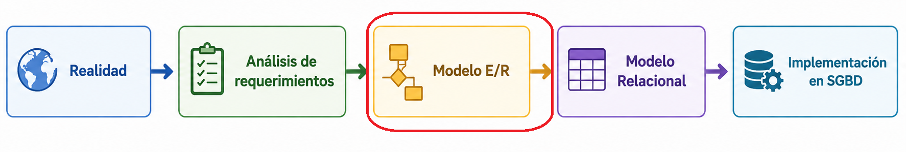
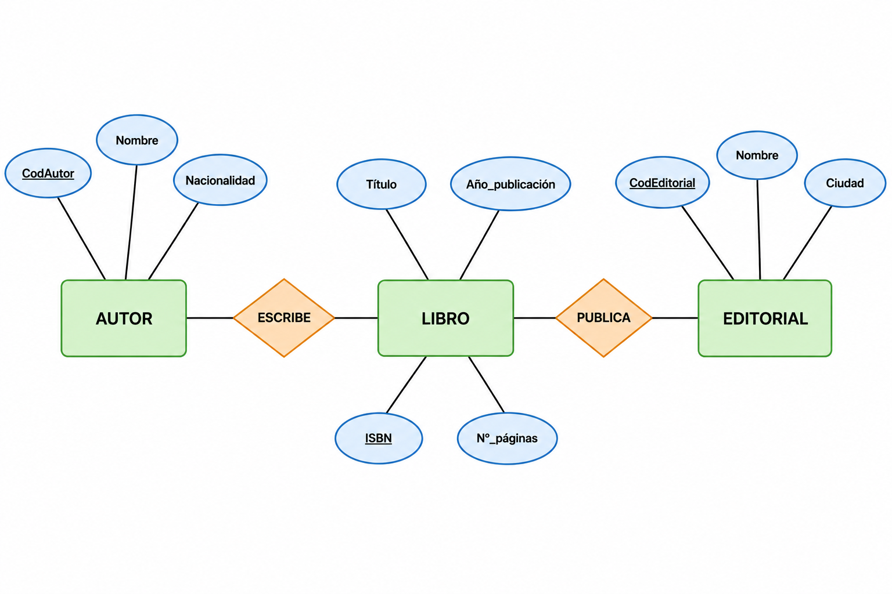
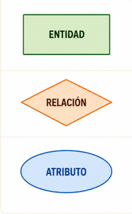

---
hide:
  - toc
---
# 1. Introducción al Modelo Entidad-Relación

En el proceso de creación de una Base de Datos, el modelo E/R es la **fase de diseño conceptual** de la base de datos.

El **Modelo Entidad-Relación (E/R)** es un modelo de alto nivel utilizado para diseñar bases de datos de forma visual y cercana a la realidad.

El modelo Entidad/Relación utiliza símbolos gráficos, como rectángulos, rombos, óvalos y líneas, para representar de forma visual las entidades, los atributos, las relaciones y las restricciones que forman parte de una base de datos.

| Ejemplo | Elementos |
|---|---|
| {width=400} | {width=200}|

!!! note  "📜 Origen"
    El Modelo E/R fue propuesto por Peter P. Chen en 1976. Posteriormente aparecieron ampliaciones conocidas como: **Modelo E/R Extendido** que incorporan nuevas características y restricciones.

