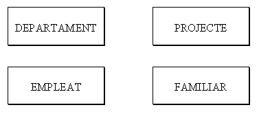
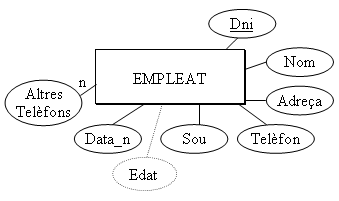
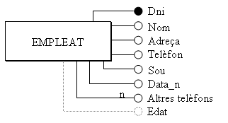
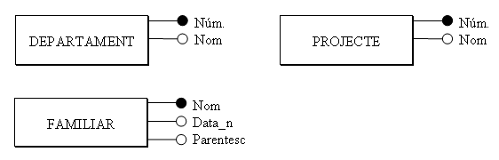

<!--
# 3. Las Entidades del Modelo E/R

Para hacer un esquema con el Modelo Entidad-Relación, empezaremos siempre por las
primeras, por las entidades.


## 3.1 Entidades

Para hacer un esquema con el Modelo Entidad-Relación, empezaremos siempre por las
primeras, por las entidades.

Es decir, a partir de las especificaciones del problema, intentaremos averiguar
las entidades.

La **ENTIDAD** será una persona, cosa, lugar, concepto o suceso, con existencia
real o abstracta, que nos es de interés.

Así por ejemplo, los empleados son entidades. Como todos los empleados tendrán para
nosotros las mismas características (nombre, dirección,...), aunque
cada uno con valores distintos, los podemos englobar en la misma estructura.

Definiremos **TIPO DE ENTIDAD** a la estructura genérica (EMPLEADO) y **OCURRENCIA
DE ENTIDAD** a cada una de las realizaciones concretas (cada uno de los
empleados, por ejemplo Juan Pérez). Evidentemente, en el diseño no nos
interesan las ocurrencias, sino el Tipo de Entidad. Lo representaremos por un
rectángulo con el nombre de la entidad en el interior (preferiblemente en singular).


### Aplicación al ejemplo


En nuestro ejemplo, el del punto 2, quedarán las siguientes Entidades:




## 3.2 Atributos


Un **ATRIBUTO** es cada una de las características de una entidad que nos
interesan.

Por ejemplo en la entidad EMPLEADO tendremos los atributos _nombre, DNI, dirección,
teléfono, sueldo_ y _fecha de nacimiento_.

No consideraremos atributos las características que no nos interesan (estatura,
talla pantalones, etc.)

Una ocurrencia de entidad tendrá un **VALOR** para cada atributo, por ejemplo
_Juan Pérez, 18.901.234, 964-22.33.44, 1.200,00€., 12-5-1960._

Pero a veces puede que el contenido de un atributo sea el valor **NULO**
(por ejemplo si no tiene teléfono o lo desconocemos).

Los atributos pueden ser **SIMPLES** o **COMPUESTOS**, si están formados por una
única información o por más de una. Así, un ejemplo de atributo compuesto sería el
nombre que podría estar formado por: _nombre=(nombre de pila, primer apellido, segundo
apellido)_.

Pueden haber atributos **MULTIVALUADOS**, que quiere decir que pueden tomar más de un
valor. Por ejemplo supongamos que en el caso anterior consideramos el campo **otros teléfonos** (por si en la empresa hay momentos que tenemos que localizar
al empleado urgentemente). Quizás un empleado no tenga ningún valor en este campo. Y
quizás otro tenga dos (el móvil y el de una segunda residencia). En
general huiremos de estos campos por comodidad, pero el modelo lo acepta.

También pueden haber atributos **DERIVADOS**, es decir, atributos que se pueden
calcular a partir de otros. Podría ser el caso del campo _edad_, que se puede
calcular a partir de la fecha del sistema y de _fecha de nacimiento_.


El modelo necesita poder identificar cada ocurrencia sin margen de error. Habrá
algún atributo (o conjunto de atributos) que cumplirá esta premisa
de identificar unívocamente. Y para que esto sea posible, este atributo
deberá tener valores distintos para todas las ocurrencias (sino no podría
identificarlas); y al mismo tiempo no podrá tener en ningún caso el valor nulo. En
el ejemplo EMPLEADO, el _nombre_ o el _DNI_ servirían para identificar. En cambio el
sueldo no serviría, ya que más de un empleado puede tener el mismo sueldo. El teléfono
tampoco, porque quizás sea nulo.

A los atributos (o conjuntos de atributos) que cumplen la condición anterior los
llamaremos **CLAVES CANDIDATAS**, y de entre todas las claves candidatas elegiremos
una y la llamaremos **CLAVE PRINCIPAL**.

Todas las entidades deben tener una clave principal. Es una de las restricciones
del Modelo E/R.


Representaremos los atributos con un círculo unido a la entidad por una línea, y en
el interior o al lado pondremos el nombre del atributo. La clave principal
la señalaremos subrayándola, o con el círculo negro.

Para los atributos multivaluados pondremos **_n_** en la línea. Y los derivados los
representaremos con líneas discontinuas.

Aquí tendríamos dos maneras (absolutamente equivalentes) de representar la entidad
EMPLEADO con sus atributos.  

 |   |   
---|---|---  

### Aplicación al ejemplo


En nuestro ejemplo del punto 2 quedarían las otras entidades con los siguientes
atributos:




-->


# 3. Las Entidades del Modelo E/R

Para hacer un esquema con el Modelo Entidad-Relación, empezaremos siempre por las primeras: las entidades.

A partir de las especificaciones del problema, intentaremos averiguar cuáles son las entidades del sistema.

---

## 3.1 Entidades

La **ENTIDAD** será una persona, cosa, lugar, concepto o suceso, con existencia real o abstracta, que nos es de interés.

---

### Ejemplo

!!! example "Ejemplo"
    Los empleados son entidades.

    Como todos los empleados tendrán para nosotros las mismas características:

    - nombre
    - dirección
    - teléfono
    - sueldo

    aunque cada uno tenga valores distintos, los podemos englobar dentro de la misma estructura.

---

### Tipo de Entidad y Ocurrencia

Definiremos:

| Concepto | Significado |
|---|---|
| **TIPO DE ENTIDAD** | La estructura genérica (por ejemplo EMPLEADO) |
| **OCURRENCIA DE ENTIDAD** | Cada realización concreta (por ejemplo Juan Pérez) |

---

!!! tip "Importante"
    En el diseño de bases de datos nos interesan los **tipos de entidad**, no las ocurrencias concretas.

### Representación gráfica


=== "Representación gráfica"

    

    Las entidades se representan mediante:

    - un rectángulo
    - con el nombre de la entidad en su interior
    - preferiblemente en singular

=== "Esquema de entidades del ejemplo"

    <div style="display:flex; gap:4rem; justify-content:center; margin-top:2rem;">

    <div>

    <div style="
    border:2px solid black;
    width:220px;
    height:90px;
    display:flex;
    align-items:center;
    justify-content:center;
    margin-bottom:3rem;
    font-size:1.4rem;
    ">
    DEPARTAMENT
    </div>

    <div style="
    border:2px solid black;
    width:220px;
    height:90px;
    display:flex;
    align-items:center;
    justify-content:center;
    font-size:1.4rem;
    ">
    EMPLEAT
    </div>

    </div>

    <div>

    <div style="
    border:2px solid black;
    width:220px;
    height:90px;
    display:flex;
    align-items:center;
    justify-content:center;
    margin-bottom:3rem;
    font-size:1.4rem;
    ">
    PROJECTE
    </div>

    <div style="
    border:2px solid black;
    width:220px;
    height:90px;
    display:flex;
    align-items:center;
    justify-content:center;
    font-size:1.4rem;
    ">
    FAMILIAR
    </div>

    </div>

    </div>


## 3.2 Atributos

Un **ATRIBUTO** es cada una de las características de una entidad que nos interesan.

---

### Ejemplo

!!! example "Entidad EMPLEADO"
    En la entidad EMPLEADO tendremos atributos como:

    - nombre
    - DNI
    - dirección
    - teléfono
    - sueldo
    - fecha de nacimiento

---

### Atributos que no interesan

No consideraremos atributos aquellas características que no sean relevantes para el sistema.

Por ejemplo:

- estatura
- talla de pantalones
- color favorito

---

### Valores de los atributos

Cada ocurrencia de entidad tendrá un valor para cada atributo.

### Ejemplo

| Nombre | DNI | Teléfono | Sueldo |
|---|---|---|---|
| Juan Pérez | 18.901.234 | 964-22.33.44 | 1.200 € |

---

!!! warning "Valores nulos"
    A veces un atributo puede tomar el valor **NULO**.

    Por ejemplo:

    - un empleado sin teléfono
    - un dato desconocido

---

### Tipos de atributos

#### Atributos simples

Contienen una única información.

#### Ejemplo

- sueldo
- DNI
- fecha de nacimiento

---

#### Atributos compuestos

Están formados por varias partes.

#### Ejemplo

```text
nombre = (
    nombre de pila,
    primer apellido,
    segundo apellido
)
```

---

### Atributos multivaluados

Pueden contener más de un valor.

#### Ejemplo

```text
otros teléfonos = (
    móvil,
    segunda residencia
)
```

---

!!! note "Observación"
    En general evitaremos este tipo de atributos por comodidad, aunque el modelo los permite.

---

### Atributos derivados

Son atributos que pueden calcularse a partir de otros.

### Ejemplo

```text
edad = fecha actual - fecha de nacimiento
```

---

### Claves

El modelo necesita poder identificar cada ocurrencia de forma única.

Por ello existirán atributos capaces de identificar unívocamente cada entidad.

---

#### Condiciones de una clave

Una clave:

- no puede repetirse
- no puede tomar valores nulos

---

#### Ejemplo

| Atributo | ¿Sirve como clave? | Motivo |
|---|---|---|
| DNI | ✅ | Identifica unívocamente |
| Nombre | ✅ | Podría identificar |
| Sueldo | ❌ | Puede repetirse |
| Teléfono | ❌ | Puede ser nulo |

---

### Clave candidata y clave principal

| Concepto | Significado |
|---|---|
| **Clave candidata** | Atributo que puede identificar una entidad |
| **Clave principal** | Clave candidata elegida como identificador principal |

---

!!! info "Restricción del Modelo E/R"
    Todas las entidades deben tener una clave principal.

---

### Representación de atributos

Los atributos se representan mediante:

- un círculo unido a la entidad
- el nombre del atributo en su interior o junto a él

---

### Representaciones especiales

| Tipo | Representación |
|---|---|
| Clave principal | Subrayada o círculo negro |
| Multivaluado | Línea con n |
| Derivado | Línea discontinua |

---

### Ejemplo gráfico

Aquí tendríamos dos maneras equivalentes de representar la entidad EMPLEADO con sus atributos.

<!-- INSERTAR IMAGEN -->

---

### Aplicación al ejemplo

En nuestro ejemplo del punto 2, las entidades quedarían con los siguientes atributos:

<!-- INSERTAR IMAGEN -->

