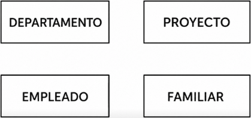
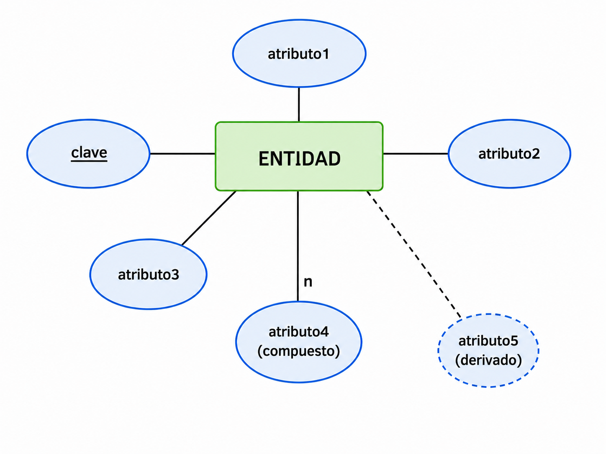
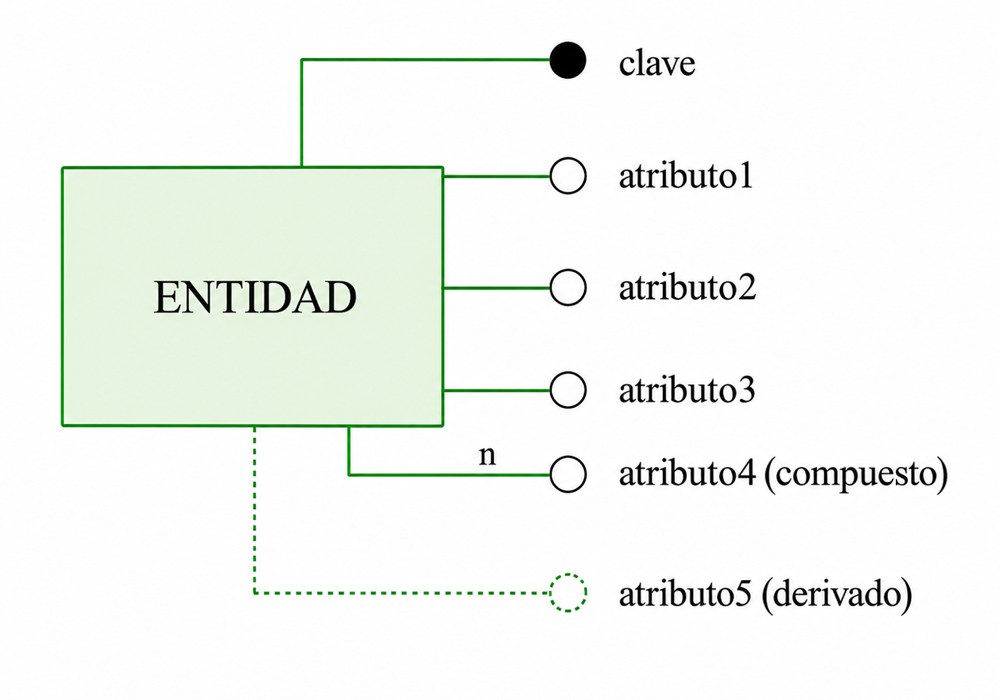
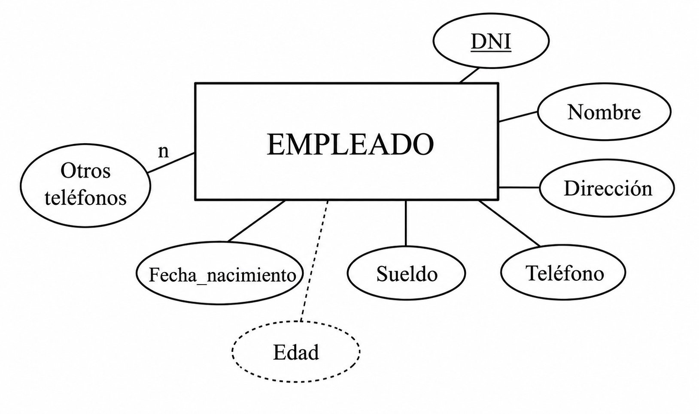
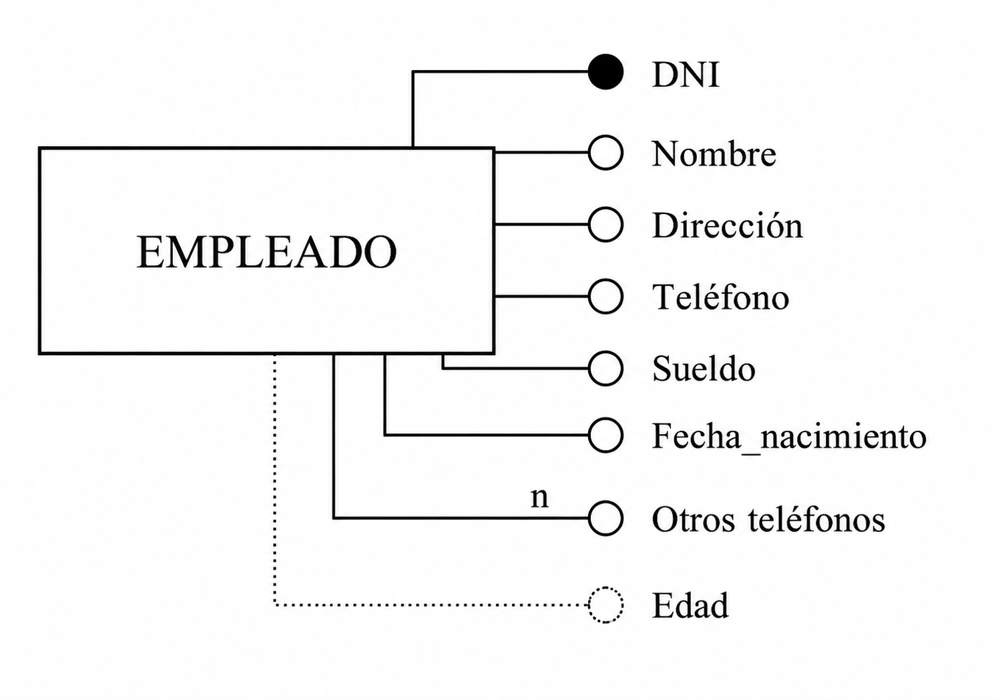
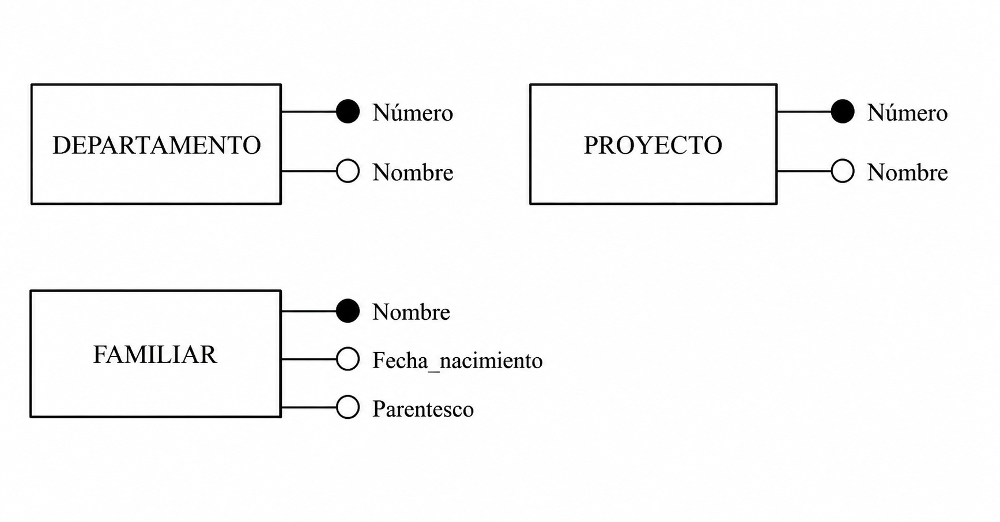

# 3. Entidades y Atributos

A partir del análisis de requerimientos, intentaremos averiguar cuáles son las entidades y atributos del sistema.

??? "Ejemplo: Empresa"

    - La compañía está organizada en departamentos. 
    - Cada uno tiene nombre único, número único y un empleado que lo dirige. Nos interesa la fecha en la que comenzó a dirigirlo.  

    - Cada departamento controla una serie de proyectos. Cada uno de estos proyectos tiene nombre y número únicos, y estará coordinado por un único departamento.

    - De cada empleado nos interesa el nombre (formado por dos apellidos y nombre de pila), DNI, dirección, teléfono, sueldo y fecha de nacimiento. Todo empleado está asignado a un departamento, y muchas veces tendrá un supervisor. Puede trabajar en más de un proyecto (no necesariamente controlados por el mismo departamento) y trabajará un determinado número de horas a la semana en cada proyecto. En un proyecto siempre trabajará, como mínimo, un empleado.

    - Queremos saber también los familiares de cada empleado, para administrar los términos de un seguro. Queremos saber el nombre, fecha de nacimiento y parentesco con el empleado.  

---

## 3.1 Entidades

La **ENTIDAD** será una persona, cosa, lugar, concepto o suceso, con existencia real o abstracta, que nos interesa.


En nuestro ejemplo, detectamos que los empleados son **entidades**. Como todos los empleados tendrán para nosotros las mismas características: (nombre, dirección, teléfono, sueldo...) los podemos englobar dentro de la misma estructura: **EMPLEADO**.

---

### Tipo de Entidad y Ocurrencia

Definiremos:

| Concepto | Significado |
|---|---|
| **TIPO DE ENTIDAD** | La estructura genérica (por ejemplo EMPLEADO) |
| **OCURRENCIA DE ENTIDAD** | Cada realización concreta (cada empleado, por ejemplo Juan Pérez) |

---

!!! tip "Importante"
    En el diseño de bases de datos nos interesan los **tipos de entidad**, no las ocurrencias concretas.


=== "Representación gráfica"

    Las entidades se representan mediante:

    - un rectángulo
    - con el nombre de la entidad en su interior
    - preferiblemente en singular

    

=== "Entidades del ejemplo"

    

   


## 3.2 Atributos

Un **ATRIBUTO** es cada una de las características de una entidad que nos interesan.

---


!!! example "Ejemplo"

    ```text title="👤 EMPLEADO"
    Nombre completo, DNI, dirección.
    Teléfono, sueldo, fecha de nacimiento.
    Asignados a un departamento con supervisor.
    Trabaja en varios proyectos.
    Trabaja unas horas semanales por proyecto.
    ```


    En la entidad EMPLEADO tendremos atributos como:

    - Nombre
    - DNI
    - Dirección
    - Teléfono
    - Sueldo
    - Fecha de nacimiento

---

!!! failure  "Atributos que no interesan"
    No consideraremos atributos aquellas características que no sean relevantes para el sistema. Por ejemplo: estatura, talla de pantalones, color favorito...etc

---

### Valores de los atributos

Cada ocurrencia de entidad tendrá un valor para cada atributo.


| Nombre | DNI | Dirección | Teléfono | Sueldo | Fecha de nacimiento
|---|---|---|---|---|---|
| Juan Pérez | 18.901.234 | c/ Colón 23, Castellón 12503 | 964.22.33.44 | 1.200 € | 22-3-1970

---

!!! warning "Valores nulos"
    A veces un atributo puede tomar el valor **NULO**.

    Por ejemplo:

    - un empleado sin teléfono


    | Nombre | DNI | Dirección | Teléfono | Sueldo | Fecha de nacimiento
    |---|---|---|---|---|---|
    | Juan Pérez | 18.901.234 | c/ Colón 23 |  | 1.200 € | 22-3-1970

---

### Tipos de atributos

#### Atributos simples

Contienen una única información, como el sueldo, el dni o la fecha de nacimiento.


#### Atributos compuestos

Están formados por varias partes.

**Ejemplo**

```text
Nombre = (nombre de pila, primer apellido, segundo apellido)
Dirección= (calle, ciudad, codigo postal)
```

---

#### Atributos multivaluados

Pueden contener más de un valor.

**Ejemplo**

```text
Otros teléfonos = (móvil, segunda residencia)
```

| Nombre | DNI | Dirección | Teléfono | Sueldo | Fecha de nacimiento | Otros teléfonos |
|---|---|---|---|---|---|---|
| Juan Pérez | 18.901.234 | c/ Colón 23, Castellón 12503 | 964.22.33.44 | 1.200 € | 22-3-1970 | 607.312.456, 964.11.22.44 |


!!! note "Observación"
    En general evitaremos los atributos compuestos y multivaluados, aunque el modelo los permite.

---

#### Atributos derivados

Son atributos que pueden calcularse a partir de otros.

**Ejemplo**

```text
Edad = fecha actual - fecha de nacimiento
```

| Nombre | DNI | Dirección | Teléfono | Sueldo | Fecha de nacimiento | Otros teléfonos | Edad
|---|---|---|---|---|---|---|---|
| Juan Pérez | 18.901.234 | c/ Colón 23, Castellón 12503 | 964.22.33.44 | 1.200 € | 22-3-1970 | 607.312.456, 964.11.22.44 | 56 |


### Claves

El modelo E/R necesita poder identificar cada ocurrencia de forma única.

Por ello existirán **atributos** capaces de identificar unívocamente cada entidad.

---

!!! Warning "Condiciones que debe tener una clave"
    Una clave:

    - no puede repetirse
    - no puede tomar valores nulos

---

**Ejemplo**

| Atributo | ¿Sirve como clave? | Motivo |
|---|---|---|
| DNI | ✅ | Identifica unívocamente |
| Nombre | ✅ | Podría identificar |
| Sueldo | ❌ | Puede repetirse |
| Teléfono | ❌ | Puede ser nulo |

---

### Clave candidata y clave principal

Los atributos (o conjuntos de atributos) que cumplen la condición anterior se denominan **claves candidatas**. Como una tabla puede tener varias claves candidatas, se elige una de ellas para identificar de forma única cada registro. Esta clave recibe el nombre de **clave principal**.

| Concepto | Significado |
|---|---|
| **Clave candidata** | Atributo que puede identificar una entidad |
| **Clave principal** | Clave candidata elegida como identificador principal |

---

!!! info "Restricción del Modelo E/R"
    Todas las entidades deben tener una clave principal.

---

### Representación de atributos

=== "Representación gráfica"

    Los atributos se representan de 2 maneara posibles: 

    - Un óvalo unido a una entidad.
    - El nombre del atributo se escribe en su interior o junto a el.

    | Representación 1| Representación 2 |
    |---|---|
    | {width=400}  | {width=400} |

   
=== "Atributos de Empleado"

    
    | Representación 1| Representación 2 |
    |---|---|
    | {width=400}  | {width=400} |


---

### Representaciones especiales

| Tipo | Representación |
|---|---|
| Clave principal | Subrayada o círculo negro |
| Multivaluado | Línea con n |
| Derivado | Línea discontinua |


---

### Aplicación al ejemplo

En nuestro ejemplo, el resto de las entidades quedarían con los siguientes atributos:



