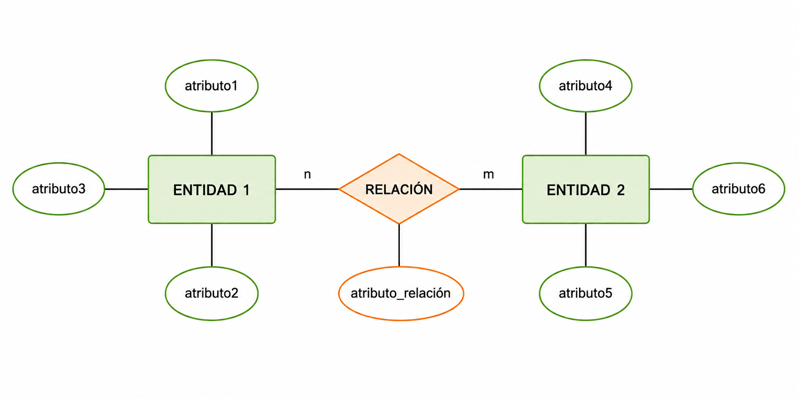
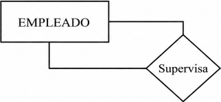
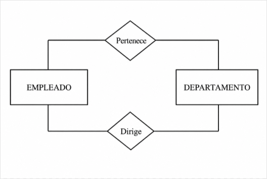
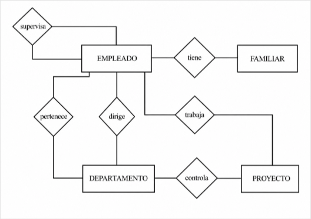
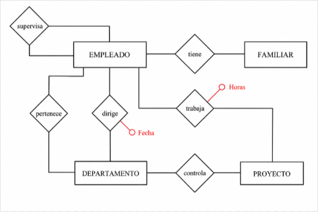
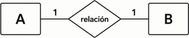
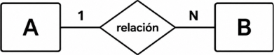
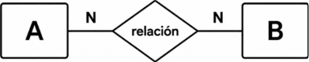
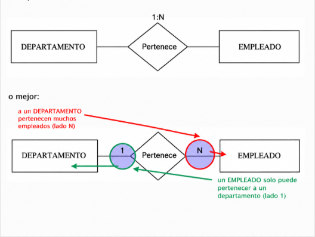
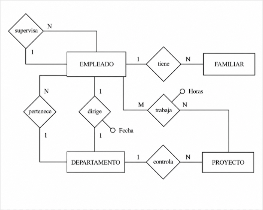

# 4. Las Relaciones del Modelo E/R

Hasta ahora solo hemos definido entidades. Ahora conectaremos entidades entre ellas.

**Ejemplo**: Juan Pérez trabaja en Contabilidad. El empleado trabaja en un proyecto X dedicando 20 horas semanales.

---

## 4.1 Concepto de Relación

### Definición

**RELACIÓN** es una asociación o correspondencia entre entidades.

| Término | Significado |
|---------|-------------|
| **Tipo de Relación** | Estructura genérica entre tipos de entidad |
| **Ocurrencia de Relación** | Instancia concreta (ej: Juan Pérez → Contabilidad) |

### Representación Gráfica

=== "Elementos"
    - **Forma**: Rombo
    - **Etiqueta**: Nombre de la relación (generalmente un verbo)
    - **Conexión**: Líneas hacia las entidades relacionadas

    {width=500}

   
### Grados de una Relación

El **GRADO** es el número de entidades que participan en la relación:

- **Binaria (Grado 2)**

    

    Relación entre dos entidades.   
    **Ejemplo:** Empleado pertenece a departamento

- **Ternaria (Grado 3)**

    

    Relación entre tres entidades.  
    **Ejemplo:** Departamento compra producto a Proveedor.

- **Reflexiva (Grado 1)**

    

    Relación de una entidad consigo misma.  
    **Ejemplo:** Empleado es supervisor (además de ser empleado).

- **n-aria**

    

    Relación entre más de 3 entidades

---

### Múltiples Relaciones

Dos entidades pueden tener **más de una relación** entre ellas:

!!! info "Ejemplo"
    **EMPLEADO** y **DEPARTAMENTO**:  
    - Relación 1: "PERTENECE" (el empleado pertenece a un departamento)  
    - Relación 2: "DIRIGE" (un empleado dirige el departamento)  
    
    **Importante**: Siempre poner nombre a la relación para evitar confusiones.

---

### Aplicación al ejemplo

??? "Ejemplo: Empresa"

    - La compañía está organizada en departamentos. 
    - Cada uno tiene nombre único, número único y un empleado que lo dirige. Nos interesa la fecha en la que comenzó a dirigirlo.  

    - Cada departamento controla una serie de proyectos. Cada uno de estos proyectos tiene nombre y número únicos, y estará coordinado por un único departamento.

    - De cada empleado nos interesa el nombre (formado por dos apellidos y nombre de pila), DNI, dirección, teléfono, sueldo y fecha de nacimiento. Todo empleado está asignado a un departamento, y muchas veces tendrá un supervisor. Puede trabajar en más de un proyecto (no necesariamente controlados por el mismo departamento) y trabajará un determinado número de horas a la semana en cada proyecto. En un proyecto siempre trabajará, como mínimo, un empleado.

    - Queremos saber también los familiares de cada empleado, para administrar los términos de un seguro. Queremos saber el nombre, fecha de nacimiento y parentesco con el empleado.  

---

Después de incorporar las relaciones, nuestro ejemplo quedará:

## 4.2 Atributos de la Relación

Las relaciones **también pueden tener atributos**, igual que las entidades.

!!! Tip "Diferencia Clave"
    Los atributos de la relación NO pertenecen a una entidad específica, sino a la asociación entre entidades.

**Ejemplos**

| Relación | Atributo | Significado |
|----------|----------|-------------|
| TRABAJA | Horas semanales | Horas que dedica un empleado a un proyecto |
| DIRIGE | Fecha inicio | Cuándo comenzó a dirigir el departamento |
| COMPRA | Cantidad | Número de unidades compradas |

### Aplicación al ejemplo

Representaremos los atributos de relación como los atributos de entidad, pero ahora unidos a las relaciones.

Los atributos de la relación se representan como círculos unidos a la relación (rombo).

!!! tip "Buena Práctica"
    Siempre nombra claramente las relaciones con verbos activos para que su significado sea evidente. Si la relación es ambigua o poco clara, el nombre es imprescindible.

## 4.3 Tipo de Relación o Cardinalidad

La **cardinalidad** permite expresar cuántas ocurrencias de una entidad pueden
relacionarse con una ocurrencia de la otra.

Sin cardinalidad, el diagrama queda incompleto. Por ejemplo, sabríamos que
EMPLEADO se relaciona con DEPARTAMENTO, pero no si un empleado puede pertenecer
a uno o a varios departamentos.

- **1:1 (uno a uno)**

        Una ocurrencia de A se relaciona como máximo 
        con una ocurrencia de B, y viceversa.

    

- **1:N (uno a muchos)**

        Una ocurrencia de A puede relacionarse con muchas de B,
        pero cada ocurrencia de B solo se relaciona con una de A.
    

- **M:N (muchos a muchos)**

        Una ocurrencia de A puede relacionarse con muchas de B,
        y una de B puede relacionarse con muchas de A.
    
    

### Cómo identificar la cardinalidad

Lo veremos con nuestro ejemplo. Para no equivocarnos, hacemos siempre dos preguntas simétricas:

| Pregunta | Respuesta en el ejemplo |
|---|---|
| A un departamento determinado, ¿cuántos empleados pueden pertenecer? | Muchos |
| Un empleado determinado, ¿a cuántos departamentos puede pertenecer? | Uno |

Con esas dos respuestas, la relación **PERTENECE** entre DEPARTAMENTO y EMPLEADO es **1:N**.

### Representación en el diagrama

!!! note "Nota"
    La cardinalidad **M:N** también se puede representar como **N:N**.
    En ambos casos significa muchas ocurrencias en los dos lados.

### Aplicación al ejemplo

??? "Ejemplo: Empresa"

    - La compañía está organizada en departamentos. 
    - Cada uno tiene nombre único, número único y un empleado que lo dirige. Nos interesa la fecha en la que comenzó a dirigirlo.  

    - Cada departamento controla una serie de proyectos. Cada uno de estos proyectos tiene nombre y número únicos, y estará coordinado por un único departamento.

    - De cada empleado nos interesa el nombre (formado por dos apellidos y nombre de pila), DNI, dirección, teléfono, sueldo y fecha de nacimiento. Todo empleado está asignado a un departamento, y muchas veces tendrá un supervisor. Puede trabajar en más de un proyecto (no necesariamente controlados por el mismo departamento) y trabajará un determinado número de horas a la semana en cada proyecto. En un proyecto siempre trabajará, como mínimo, un empleado.

    - Queremos saber también los familiares de cada empleado, para administrar los términos de un seguro. Queremos saber el nombre, fecha de nacimiento y parentesco con el empleado.  

---

Al incorporar cardinalidades, el modelo describe con más precisión la realidad del sistema:

