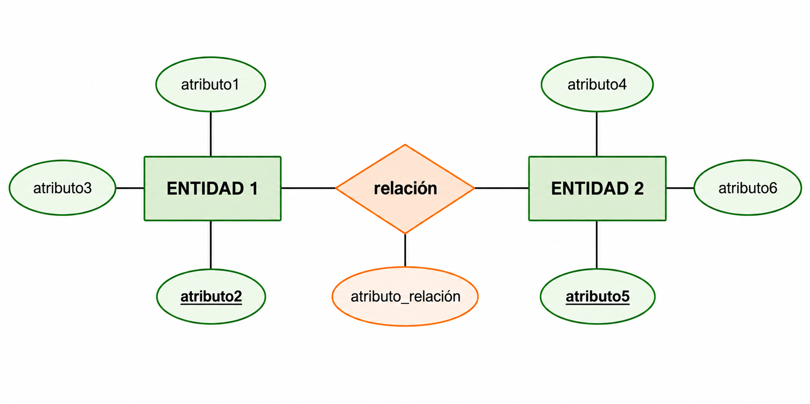

# 4. Las Relaciones del Modelo E/R

Hasta ahora solo hemos definido entidades. Ahora conectaremos entidades entre ellas.

---

## 4.1 Concepto de Relación

### Definición

**RELACIÓN** es una asociación o correspondencia entre entidades.

### Representación Gráfica

=== "Elementos"

    - **Forma**: Rombo
    - **Etiqueta**: Nombre de la relación (generalmente un verbo)
    - **Conexión**: Líneas hacia las entidades relacionadas

    {width=500}

| Término | Significado |
|---------|-------------|
| **Tipo de Relación** | Define qué entidades pueden relacionarse |
| **Ocurrencia de Relación** | Indica qué ejemplares concretos están relacionados |

### Ejemplo

Supongamos el siguiente **tipo de relación**:

**EMPLEADO — trabaja en — DEPARTAMENTO**

Este tipo de relación indica, de forma general, que un empleado puede trabajar en un departamento.

Una **ocurrencia concreta** de esta relación sería:

**Juan Pérez — trabaja en — Contabilidad**

!!! example "Recuerda"
    - **Tipo de relación:** EMPLEADO — trabaja en — DEPARTAMENTO
    - **Ocurrencia:** Juan Pérez — trabaja en — Contabilidad

    {width=500}

   
### Grados de una Relación

El **GRADO** es el número de entidades que participan en la relación:

- **Binaria (Grado 2)**

    

    Relación entre dos entidades.   
    **Ejemplo:** Empleado pertenece a departamento

- **Ternaria (Grado 3)**

    

    Relación entre tres entidades.  
    **Ejemplo:** Departamento compra producto a Proveedor.

- **Reflexiva (Grado 1)**

    

    Relación de una entidad consigo misma.  
    **Ejemplo:** Empleado es supervisor (además de ser empleado).

- **n-aria**

    

    Relación entre más de 3 entidades

---

### Múltiples Relaciones

Dos entidades pueden tener **más de una relación** entre ellas:

!!! info "Ejemplo"
    **EMPLEADO** y **DEPARTAMENTO**:  
    - Relación 1: "PERTENECE" (el empleado pertenece a un departamento)  
    - Relación 2: "DIRIGE" (un empleado dirige el departamento)  
    
    **Importante**: Siempre poner nombre a la relación para evitar confusiones.

---

### Aplicación al ejemplo

??? "Ejemplo: Empresa"

    - La compañía está organizada en departamentos. 
    - Cada uno tiene nombre único, número único y un empleado que lo <mark>dirige</mark>. Nos interesa la fecha en la que comenzó a dirigirlo.  

    - Cada departamento <mark>controla</mark> una serie de proyectos. Cada uno de estos proyectos tiene nombre y número únicos, y estará <mark>coordinado</mark> por un único departamento.

    - De cada empleado nos interesa el nombre (formado por dos apellidos y nombre de pila), DNI, dirección, teléfono, sueldo y fecha de nacimiento. Todo empleado está <mark>asignado</mark> a un departamento, y muchas veces <mark>tendrá</mark> un supervisor. Puede <mark>trabajar</mark> en más de un proyecto (no necesariamente controlados por el mismo departamento) y trabajará un determinado número de horas a la semana en cada proyecto. En un proyecto siempre trabajará, como mínimo, un empleado.

    - Queremos saber también los familiares <mark>de cada</mark> empleado, para administrar los términos de un seguro. Queremos saber el nombre, fecha de nacimiento y parentesco con el empleado.  

---

Después de incorporar las relaciones, nuestro ejemplo quedará:

## 4.2 Atributos de la Relación

Las relaciones **también pueden tener atributos**, igual que las entidades.

!!! Tip "Diferencia Clave"
    Los atributos de la relación NO pertenecen a una entidad específica, sino a la asociación entre entidades.

**Ejemplos**

| Relación | Atributo | Significado |
|----------|----------|-------------|
| TRABAJA | Horas semanales | Horas que dedica un empleado a un proyecto |
| DIRIGE | Fecha inicio | Cuándo comenzó a dirigir el departamento |

### Aplicación al ejemplo

Representaremos los atributos de relación como los atributos de entidad, pero ahora unidos a las relaciones.

Los atributos de la relación se representan como círculos unidos a la relación (rombo).

!!! tip "Buena Práctica"
    Siempre nombra claramente las relaciones con verbos activos para que su significado sea evidente. Si la relación es ambigua o poco clara, el nombre es imprescindible.

## 4.3 Tipo de Relación o Cardinalidad

La **cardinalidad** permite expresar cuántas ocurrencias de una entidad pueden
relacionarse con una ocurrencia de la otra.

Sin cardinalidad, el diagrama queda incompleto. Por ejemplo, sabríamos que
EMPLEADO se relaciona con DEPARTAMENTO, pero no si un empleado puede pertenecer
a uno o a varios departamentos.

- **1:1 (uno a uno)**

        Una ocurrencia de A se relaciona como máximo 
        con una ocurrencia de B, y viceversa.

    

- **1:N (uno a muchos)**

        Una ocurrencia de A puede relacionarse con muchas de B,
        pero cada ocurrencia de B solo se relaciona con una de A.
    

- **M:N (muchos a muchos)**

        Una ocurrencia de A puede relacionarse con muchas de B,
        y una de B puede relacionarse con muchas de A.
    
    

### Cómo identificar la cardinalidad

Lo veremos con nuestro ejemplo. Para no equivocarnos, hacemos siempre dos preguntas simétricas:

| Pregunta | Respuesta en el ejemplo |
|---|---|
| A un departamento determinado, ¿<mark>cuántos</mark> empleados pueden pertenecer? | Muchos |
| Un empleado determinado, ¿a <mark>cuántos</mark> departamentos puede pertenecer? | Uno |

Con esas dos respuestas, la relación **PERTENECE** entre DEPARTAMENTO y EMPLEADO es **1:N**.

### Representación en el diagrama

!!! warning "¡Atención! La cardinalidad se lee en el otro lado de la relación"
    En esta notación, para saber con cuántas ocurrencias de B puede relacionarse **una ocurrencia de A**, hay que mirar el número o la letra situado **junto a B, en el extremo opuesto**.

    - Desde **DEPARTAMENTO**, miramos la **N junto a EMPLEADO**: un departamento puede tener muchos empleados.
    - Desde **EMPLEADO**, miramos el **1 junto a DEPARTAMENTO**: un empleado solo puede pertenecer a un departamento.

    **Recuerda: parte de una entidad, cruza la relación y lee la cardinalidad del otro lado.**

!!! note "Nota"
    La cardinalidad **M:N** también se puede representar como **N:N**.
    En ambos casos significa muchas ocurrencias en los dos lados.

### Aplicación al ejemplo

??? "Ejemplo: Empresa"

    - La compañía está organizada en departamentos. 

    - Cada uno tiene nombre único, número único y <mark>un</mark> empleado que lo dirige. 
      Nos interesa la fecha en la que comenzó a dirigirlo.

    - Cada departamento controla <mark>una serie</mark> de proyectos. 
      Cada uno de estos proyectos tiene nombre y número únicos, y estará coordinado 
      por <mark>un único</mark> departamento.

    - De cada empleado nos interesa el nombre (formado por dos apellidos y nombre de pila), 
      DNI, dirección, teléfono, sueldo y fecha de nacimiento. 
      Todo empleado está asignado <mark>a un</mark> departamento, y muchas veces tendrá 
      <mark>un</mark> supervisor. 
      Puede trabajar en <mark>más de un</mark> proyecto (no necesariamente controlados 
      por el mismo departamento) y trabajará un determinado número de horas a la semana 
      en cada proyecto. 
      En un proyecto siempre trabajará, como mínimo, un empleado.

    - Queremos saber también los <mark>familiares</mark> de cada empleado, para administrar 
      los términos de un seguro. Queremos saber el nombre, fecha de nacimiento y parentesco 
      con el empleado.

---

!!! note "¿Y si el enunciado no indica la cardinalidad?"
    Fíjate: las cardinalidades no siempre aparecen indicadas de forma explícita. Expresiones como un, un único, varios, una serie, más de uno o el uso del plural nos ayudan a deducirlas. Cuando el enunciado no proporciona suficiente información, debemos aplicar el sentido común y, si existe ambigüedad, consultar al usuario.
