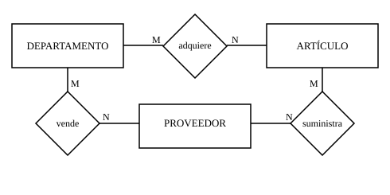
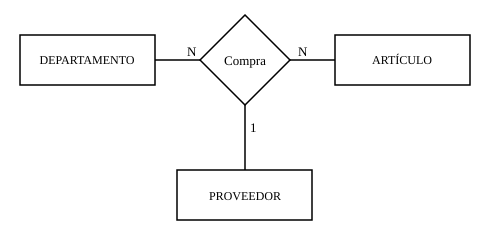
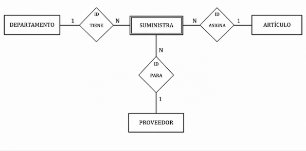

# 5. Relaciones ternarias

En este apartado profundizamos en las **relaciones ternarias** (grado 3),
que son un caso típico de relación de grado mayor que dos.

---

## 5.1 Relación ternaria frente a tres binarias

A veces se intenta representar una relación ternaria como tres relaciones binarias.
En ciertos casos puede servir, pero no siempre conserva el mismo significado.

| Relación ternaria completa | Descomposición en binarias |
|---|---|
| { width="100%" } | { width="100%" } |

=== "Qué problema aparece"

    Si descomponemos la relación en tres relaciones binarias, pueden darse situaciones ambiguas.

    Por ejemplo:

    - Contabilidad adquiere una calculadora.
    - Contabilidad compra a Distribuciones García, S.L.
    - Distribuciones García, S.L. suministra calculadoras.

    Sin embargo, con estas relaciones por separado no se garantiza que la calculadora adquirida por Contabilidad sea precisamente la suministrada por ese proveedor.

=== "Qué aporta la ternaria"

    En una relación ternaria queda registrada, de forma conjunta:

    - quién realiza la compra,
    - qué producto compra,
    - y a qué proveedor se lo compra.

    De esta forma, la relación mantiene el significado completo de la operación y evita ambigüedades.

    Por ello, una relación ternaria puede aportar más información semántica que tres relaciones binarias independientes.

---

## 5.2 Cardinalidad en relaciones ternarias

En una relación ternaria, la cardinalidad se interpreta fijando dos entidades
y observando cuántas ocurrencias intervienen de la tercera.

- Fijamos: **Departamento + Artículo**

	¿A cuántos **proveedores** puede comprar ese departamento ese artículo?

- Fijamos: **Artículo + Proveedor**

	¿Cuántos **departamentos** compran ese artículo a ese proveedor?

- Fijamos: **Departamento + Proveedor**

	¿Cuántos **artículos** compra ese departamento a ese proveedor?

En el ejemplo, las tres respuestas pueden ser **N**.
Por eso suele aparecer una cardinalidad **N:N:N**.

No obstante, no tiene por qué ser siempre así.
Por ejemplo, si un departamento compra cada artículo siempre al mismo proveedor,
en ese lado la cardinalidad sería **1**.

!!! note "Nota"
	En relaciones ternarias suele usarse la notación con **N**.
	En este contexto no usamos **M**, aunque el significado práctico es equivalente.

---

## 5.3 Transformación a relaciones binarias

Algunas herramientas de diseño de bases de datos solo permiten relaciones binarias.
En ese caso se puede aplicar una transformación:

1. Crear una entidad nueva que represente la combinación ternaria.
2. Conectarla con las tres entidades originales mediante relaciones binarias.
3. Hacer que dependa en identificación de esas entidades (entidad débil).

Este enfoque es un recurso técnico de modelado.
La explicación formal de entidades débiles aparece en el siguiente apartado.

