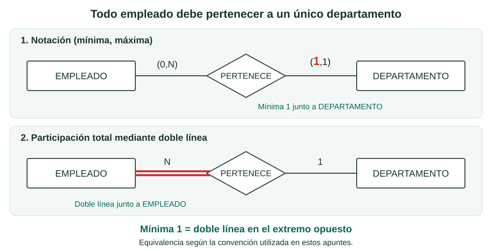
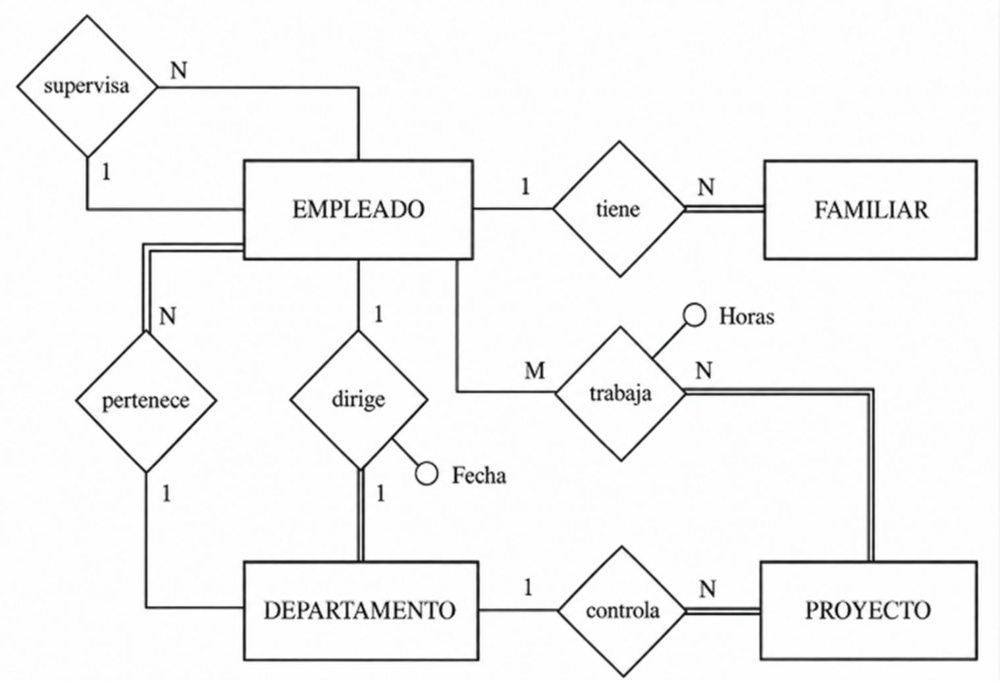

# 6. Modelo E/R Extendido

El modelo E/R que hemos visto hasta ahora es muy potente, pero en algunos casos
se queda corto para representar restricciones reales del sistema.

Por ejemplo:

- de FAMILIAR solo nos interesan los familiares de EMPLEADOS,
- si un empleado deja la empresa, sus familiares dejan de interesarnos,
- y no todas las entidades participan igual en una relación 1:1.

Para cubrir estos casos usamos el **Modelo Entidad-Relación Extendido (EER)**.

---

## 6.1 Cardinalidad máxima y mínima. Participación total

Hasta ahora, la cardinalidad **1 o N** nos indicaba el número **máximo** de ocurrencias que podían relacionarse. Ahora añadimos otra pregunta: **¿es obligatorio participar en la relación?**

Esta obligación se puede expresar de **dos maneras equivalentes**: mediante la **cardinalidad mínima** o mediante la **participación total/parcial**.

### Primera forma: notación (mínima, máxima)

El par **(mínima, máxima)** indica cuántas ocurrencias de una entidad pueden relacionarse con una de la otra:

- La **mínima** indica si la participación es opcional (**0**) u obligatoria (**1**).
- La **máxima** indica si puede relacionarse con una (**1**) o con muchas (**N**).

Por ejemplo, **(0,N)** significa de cero a muchas; **(1,1)**, exactamente una.

### Segunda forma: participación total o parcial

Podemos expresar esa misma obligatoriedad mediante las líneas que unen cada entidad con la relación, manteniendo **1 o N** para indicar la cardinalidad máxima.

| Participación | Significado | Representación |
|---|---|---|
| <strong style="white-space: nowrap;">Total (mínima 1)</strong> | Todas las ocurrencias de la entidad deben participar al menos una vez. | **Doble línea** junto a esa entidad. |
| <strong style="white-space: nowrap;">Parcial (mínima 0)</strong> | Puede haber ocurrencias de la entidad que no participen. | **Línea simple** junto a esa entidad. |

### La misma información, dos representaciones

!!! note "Fíjate en el lado"
    Con nuestra convención, la **mínima 1** corresponde a la **doble línea del extremo opuesto**. Ambas expresan la misma obligación; cambia la forma de representarla.

---
### Aplicación al ejemplo

Los siguientes diagramas muestran el mismo ejemplo de Empresa con las dos representaciones.

??? "Ejemplo: Empresa"

    - La compañía está organizada en departamentos.
    - <mark>Cada uno tiene</mark> nombre único, número único y <mark>un empleado que lo dirige</mark>. Nos interesa la fecha en la que comenzó a dirigirlo.

    - <mark>Cada departamento controla una serie de proyectos</mark>. Cada uno de estos proyectos tiene nombre y número únicos, y <mark>estará coordinado por un único departamento</mark>.

    - De cada empleado nos interesa el nombre (formado por dos apellidos y nombre de pila), DNI, dirección, teléfono, sueldo y fecha de nacimiento. <mark>Todo empleado está asignado a un departamento</mark>, y <mark>muchas veces tendrá un supervisor</mark>. Puede trabajar en más de un proyecto (no necesariamente controlados por el mismo departamento) y trabajará un determinado número de horas a la semana en cada proyecto. En un proyecto <mark>siempre trabajará, como mínimo, un empleado</mark>.

    - Queremos saber también los familiares de cada empleado, para administrar los términos de un seguro. Queremos saber el nombre, fecha de nacimiento y parentesco con el empleado.

    En el ejemplo encontramos estas participaciones obligatorias (**mínima 1**, equivalentes a doble línea):

    - Todo departamento es dirigido por un empleado = No existen departamentos sin director.
    - Todo empleado pertenece a un departamento = No existen empleados sin departamento.
    - Todo proyecto es controlado por un departamento = No puede haber proyectos que no pertenezcan a ningún departamento.
    - Todo familiar es de algún empleado = No hay familiares que no sean de ningún empleado.
    - Todo proyecto es trabajado por algún empleado = No hay proyectos en los que no trabaje ningún empleado.

    En cambio, «muchas veces tendrá un supervisor» permite que haya empleados sin supervisor: su participación es **parcial (mínima 0)**.

**Participación total y parcial**

**Notación (mínima, máxima)**

!!! tip "¿Qué representación utilizaremos?"
    En estos apuntes utilizaremos la **participación total/parcial**: **doble línea** para la participación obligatoria y **línea simple** para la opcional, manteniendo las cardinalidades máximas **1 o N**.

    La notación **(mínima, máxima)** se ha mostrado para reconocer otra forma de expresar la misma información.

## 6.2 Entidades débiles

No todas las entidades tienen el mismo grado de independencia.

- Las entidades **regulares** tienen existencia propia.
- Las entidades **débiles** dependen de otra entidad para existir.

### Idea básica

Si desaparece la entidad fuerte de la que depende,
las ocurrencias de la entidad débil también deberían desaparecer.

**Ejemplo**: los familiares de Juan Perez.
Si desaparece el EMPLEADO Juan Perez, dejan de tener sentido esos FAMILIARES.

Las entidades débiles se representan con doble rectángulo:

### Dependencia en existencia

Cuando una entidad débil depende de otra para existir,
decimos que hay **dependencia en existencia**.

En este caso, la débil participa de forma total en una relación 1:N
respecto de la regular.

### Dependencia en identificación

Podemos tener un caso más restrictivo:
además de depender para existir, la entidad débil necesita la clave de la regular
para poder identificarse.

A esto lo llamamos **dependencia en identificación**.
Suele marcarse con **ID** junto a la relación.

### Dos ejemplos típicos

- **LIBRO - EJEMPLAR**

    Un ejemplar se identifica con:
    código de libro + número de ejemplar.

- **PROVINCIA - MUNICIPIO**

    El código de municipio necesita el código de provincia
    para evitar repeticiones.

### En nuestro ejemplo (EMPLEADO - FAMILIAR)

Si el nombre del familiar fuese suficiente para identificarlo,
modelaríamos dependencia en existencia.

Si no es suficiente, usaríamos dependencia en identificación,
con clave compuesta: **DNI del empleado + nombre del familiar**.

Representación con dependencia en existencia:

Representación con dependencia en identificación:

Representación alternativa (rombo de doble raya):

* * *

[1] En la práctica, participación total y dependencia en existencia pueden parecer
muy parecidas. Aun así conviene diferenciarlas porque en el paso al Modelo Relacional
pueden llevar a decisiones distintas.

---

## 6.3 Generalización y herencia

Otro aspecto importante del EER es la posibilidad de especializar entidades.

Por ejemplo, EMPLEADO puede refinarse en:

- JEFE,
- SECRETARIO,
- TRABAJADOR.

En este contexto:

| Concepto | Significado |
|---|---|
| **Supertipo / Superclase** | Entidad general (EMPLEADO) |
| **Subtipo / Subclase** | Entidades más específicas (JEFE, SECRETARIO, TRABAJADOR) |
| **Generalización** | Vista global desde los subtipos al supertipo |
| **Especialización** | División del supertipo en subtipos |

### Herencia

La **herencia** implica que los subtipos heredan atributos del supertipo,
por lo que no hace falta repetirlos.

Cada subtipo añade solo sus atributos propios.

Ejemplos:

- JEFE: valoración del departamento,
- SECRETARIO: pulsaciones por segundo o conocimientos de informática,
- TRABAJADOR: disponibilidad para horas extra.

### Tipos de especialización

Se clasifican con dos criterios:

- **Solapada / Disjunta**

    - **Solapada**: una ocurrencia del supertipo puede estar en varios subtipos.
    - **Disjunta**: solo puede estar en uno.

- **Total / Parcial**

    - **Total**: todas las ocurrencias del supertipo pertenecen a algún subtipo.
    - **Parcial**: puede haber ocurrencias que no pertenezcan a ninguno.

Ejemplos rápidos:

- Turno (manana, tarde, noche) puede ser solapada.
- Tipo de trabajo (jefe, secretario, trabajador) suele ser disjunta.
- Dedicación completa/no completa puede ser total.
- Tipo de trabajo puede ser parcial si hay perfiles no contemplados.

!!! note "Nota práctica"
    En el paso al Modelo Relacional, a veces se representan supertipo y subtipos,
    y otras veces se simplifica por motivos prácticos.

### Aplicación al ejemplo

??? "Ejemplo: Empresa"

    - La compañía está organizada en departamentos. 
    - Cada uno tiene nombre único, número único y un empleado que lo dirige. Nos interesa la fecha en la que comenzó a dirigirlo.  

    - Cada departamento controla una serie de proyectos. Cada uno de estos proyectos tiene nombre y número únicos, y estará coordinado por un único departamento.

    - De cada empleado nos interesa el nombre (formado por dos apellidos y nombre de pila), DNI, dirección, teléfono, sueldo y fecha de nacimiento. Todo empleado está asignado a un departamento, y muchas veces tendrá un supervisor. Puede trabajar en más de un proyecto (no necesariamente controlados por el mismo departamento) y trabajará un determinado número de horas a la semana en cada proyecto. En un proyecto siempre trabajará, como mínimo, un empleado.

    - Queremos saber también los familiares de cada empleado, para administrar los términos de un seguro. Queremos saber el nombre, fecha de nacimiento y parentesco con el empleado.  

Tomando solo los subtipos **JEFE** y **TRABAJADOR** de **EMPLEADO**:

!!!Note "Nota"
    En el triángulo, la marca **T,D** indica que la especialización es:

    - **Total**
    - **Disjunta**

