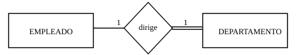
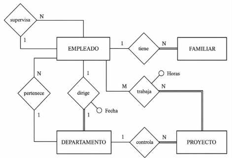
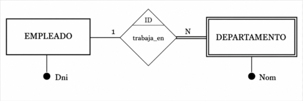
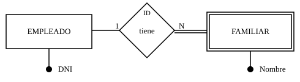
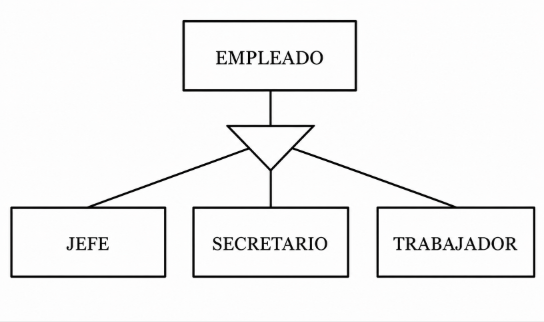
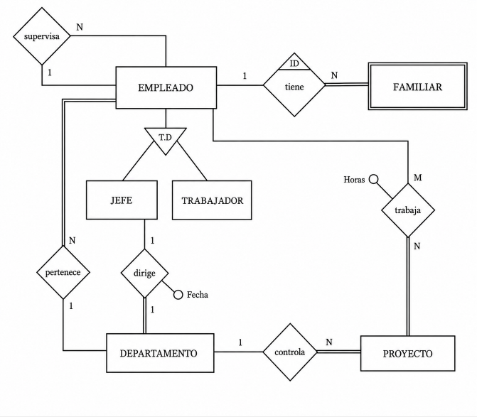

# 6. Modelo E/R Extendido

El modelo E/R que hemos visto hasta ahora es muy potente, pero en algunos casos
se queda corto para representar restricciones reales del sistema.

Por ejemplo:

- de FAMILIAR solo nos interesan los familiares de EMPLEADOS,
- si un empleado deja la empresa, sus familiares dejan de interesarnos,
- y no todas las entidades participan igual en una relación 1:1.

Para cubrir estos casos usamos el **Modelo Entidad-Relación Extendido (EER)**.

---

## 6.1 Cardinalidad máxima y mínima. Participación total

La **cardinalidad máxima y mínima** indica, para una entidad en una relación,
cuántas ocurrencias como mínimo y como máximo pueden participar.

- **Cardinalidad mínima**

    Valor mínimo de participación.
    Los valores habituales son **0** o **1**.

- **Cardinalidad máxima**

    Valor máximo de participación.
    Equivale a la cardinalidad clásica vista antes.  
    Los valores habituales son **1** o **N**.

- **Notación**

    Se suele escribir como **(mínima, máxima)** junto a la entidad.

### Ejemplo

En la relación DIRIGE:

- un EMPLEADO puede dirigir **0 o 1** departamentos,
- un DEPARTAMENTO es dirigido por **1 y solo 1** empleado.

### Participación total o parcial

Una entidad participa de forma **total** cuando todas sus ocurrencias aparecen
al menos una vez en la relación.

En cambio, participa de forma **parcial** cuando algunas ocurrencias pueden no participar.

- **Participación total**

    Mínima = 1.
    Se representa con **doble línea** en el diagrama.

- **Participación parcial**

    Mínima = 0.
    Se representa con línea simple.

- **Equivalencia**

    Participación total/parcial y cardinalidad mínima expresan la misma idea.

En estos apuntes usaremos sobre todo **participación total/parcial**,
porque su representación gráfica es muy directa.

* * *

[1] Hay autores que colocan estas marcas en el lado opuesto de la relación.

### Aplicación al ejemplo

Aplicando participación total y parcial, el ejemplo queda así:

---

## 6.2 Entidades débiles

No todas las entidades tienen el mismo grado de independencia.

- Las entidades **regulares** tienen existencia propia.
- Las entidades **débiles** dependen de otra entidad para existir.

### Idea básica

Si desaparece la entidad fuerte de la que depende,
las ocurrencias de la entidad débil también deberían desaparecer.

**Ejemplo**: los familiares de Juan Perez.
Si desaparece el EMPLEADO Juan Perez, dejan de tener sentido esos FAMILIARES.

Las entidades débiles se representan con doble rectángulo:

### Dependencia en existencia

Cuando una entidad débil depende de otra para existir,
decimos que hay **dependencia en existencia**.

En este caso, la débil participa de forma total en una relación 1:N
respecto de la regular.

### Dependencia en identificación

Podemos tener un caso más restrictivo:
además de depender para existir, la entidad débil necesita la clave de la regular
para poder identificarse.

A esto lo llamamos **dependencia en identificación**.
Suele marcarse con **ID** junto a la relación.

### Dos ejemplos típicos

- **LIBRO - EJEMPLAR**

    Un ejemplar se identifica con:
    código de libro + número de ejemplar.

- **PROVINCIA - MUNICIPIO**

    El código de municipio necesita el código de provincia
    para evitar repeticiones.

### En nuestro ejemplo (EMPLEADO - FAMILIAR)

Si el nombre del familiar fuese suficiente para identificarlo,
modelaríamos dependencia en existencia.

Si no es suficiente, usaríamos dependencia en identificación,
con clave compuesta: **DNI del empleado + nombre del familiar**.

Representación con dependencia en existencia:

Representación con dependencia en identificación:

Representación alternativa (rombo de doble raya):

* * *

[1] En la práctica, participación total y dependencia en existencia pueden parecer
muy parecidas. Aun así conviene diferenciarlas porque en el paso al Modelo Relacional
pueden llevar a decisiones distintas.

---

## 6.3 Generalización y herencia

Otro aspecto importante del EER es la posibilidad de especializar entidades.

Por ejemplo, EMPLEADO puede refinarse en:

- JEFE,
- SECRETARIO,
- TRABAJADOR.

En este contexto:

| Concepto | Significado |
|---|---|
| **Supertipo / Superclase** | Entidad general (EMPLEADO) |
| **Subtipo / Subclase** | Entidades más específicas (JEFE, SECRETARIO, TRABAJADOR) |
| **Generalización** | Vista global desde los subtipos al supertipo |
| **Especialización** | División del supertipo en subtipos |

### Herencia

La **herencia** implica que los subtipos heredan atributos del supertipo,
por lo que no hace falta repetirlos.

Cada subtipo añade solo sus atributos propios.

Ejemplos:

- JEFE: valoración del departamento,
- SECRETARIO: pulsaciones por segundo o conocimientos de informática,
- TRABAJADOR: disponibilidad para horas extra.

### Tipos de especialización

Se clasifican con dos criterios:

- **Solapada / Disjunta**

    - **Solapada**: una ocurrencia del supertipo puede estar en varios subtipos.
    - **Disjunta**: solo puede estar en uno.

- **Total / Parcial**

    - **Total**: todas las ocurrencias del supertipo pertenecen a algún subtipo.
    - **Parcial**: puede haber ocurrencias que no pertenezcan a ninguno.

Ejemplos rápidos:

- Turno (manana, tarde, noche) puede ser solapada.
- Tipo de trabajo (jefe, secretario, trabajador) suele ser disjunta.
- Dedicación completa/no completa puede ser total.
- Tipo de trabajo puede ser parcial si hay perfiles no contemplados.

!!! note "Nota práctica"
    En el paso al Modelo Relacional, a veces se representan supertipo y subtipos,
    y otras veces se simplifica por motivos prácticos.

### Aplicación al ejemplo

Tomando solo los subtipos **JEFE** y **TRABAJADOR** de **EMPLEADO**:

!!!Note "Nota"
    En el triángulo, la marca **T,D** indica que la especialización es:

    - **Total**
    - **Disjunta**

