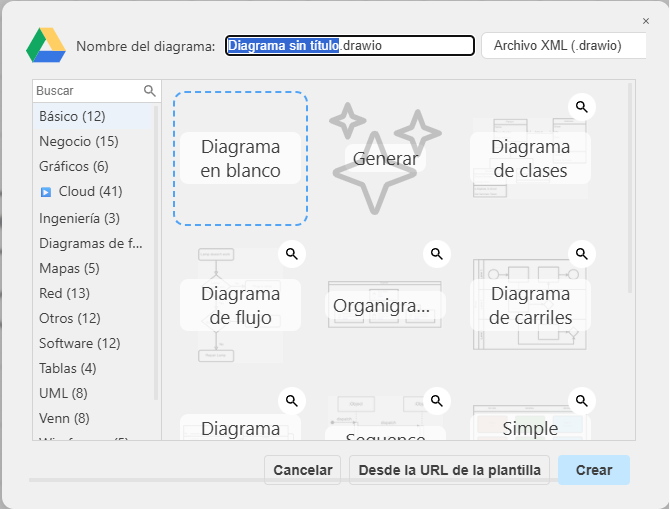
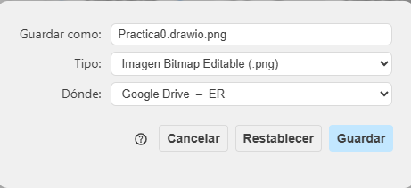
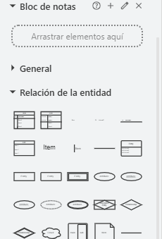

## 🧪 Objetivo

El objetivo de esta práctica no es evaluar tus conocimientos sobre el modelo Entidad/Relación, sino aprender la metodología de trabajo que utilizarás durante todo el curso.

Al finalizar esta práctica sabrás:

- Dibujar un diagrama E/R sencillo.
- Utilizar la IA como herramienta de revisión.
- Corregir un ejercicio a partir de las pistas proporcionadas por la IA.
- Consultar la solución únicamente cuando hayas terminado el proceso de revisión.

---

!!! abstract "Enunciado"
    Se desea diseñar un modelo Entidad/Relación para gestionar la información de los alumnos y los grupos de un centro educativo. De cada alumno se desea almacenar su identificador, nombre y apellidos. De cada grupo interesa conocer su identificador y su nombre. Además, cada alumno pertenece a un único grupo, mientras que un grupo puede estar formado por varios alumnos.

    ??? note "Desglose"

        - Una entidad llamada **ALUMNO**.
            - Los atributos:
                - **idAlumno** (clave primaria).
                - nombre.
                - apellidos.
        - Una entidad llamada **GRUPO**.
            - Los atributos:
                - **idGrupo** (clave primaria).
                - nombre.
        - Una relación llamada **PERTENECE** entre ambas entidades.
            - Un grupo puede tener varios alumnos.
            - Cada alumno pertenece a un único grupo.

    Puedes realizar el diagrama de una de las siguientes formas:

    - Utilizando **diagrams.net (Draw.io)** y exportándolo como **PNG**.
    - Dibujándolo a mano sobre papel y haciendo una fotografía donde se vea claramente el diagrama.

---

!!! info "Hoja de ruta"

    Sigue esta secuencia de revisión:

    1. ¿Qué entidades aparecen? -> **ALUMNO**, **GRUPO**
    2. ¿Qué atributos tiene cada una? -> ALUMNO (**idAlumno, nombre, apellidos**). GRUPO (**idGrupo, nombre**)
    3. ¿Qué relaciones existen? -> **pertenece**
    4. ¿Qué cardinalidades tienen? -> GRUPO **1:N** ALUMNO 

??? "🛠️ Herramienta Draw.io"

    Utiliza la biblioteca "Relación de la entidad" de Draw.io para representar el modelo E/R empleando la notación adecuada. Una vez finalizado el diagrama, expórtalo en formato PNG para poder subirlo a la IA y revisarlo.

    |  |  |  |
    | --- | --- | --- |
    

!!! question "Revisión con la IA"

    Una vez hayas terminado el ejercicio:

    1. Abre la IA de tu elección (ChatGPT, Copilot, Gemini, Claude, etc.).
    2. Copia el **prompt de revisión** incluido en estos apuntes.
    3. Pega el enunciado de esta práctica.
    4. Adjunta tu diagrama.
    5. Sigue las indicaciones de la IA y corrige tu propuesta tantas veces como sea necesario.
    6. Consulta la solución oficial únicamente cuando consideres que tu ejercicio es correcto o no consigas seguir avanzando.

    !!! tip "Reto"

        Intenta que la IA te indique que tu ejercicio es correcto **sin pedirle la solución**. Durante el curso utilizarás la IA como un profesor que te orienta y te ayuda a descubrir tus errores, no como una herramienta que resuelve los ejercicios por ti.

---
**¿Todavía necesitas ayuda?**

Si después de revisar tu ejercicio con la IA aún tienes dudas o no consigues encontrar la solución, no te preocupes. Antes de consultar la solución oficial, puedes utilizar los recursos de apoyo que encontrarás a continuación:

- 📄 Documento en PDF, donde se explica paso a paso el proceso de razonamiento seguido para resolver el ejercicio.
- 🎥 Vídeo explicativo, en el que se desarrolla el ejercicio de forma guiada, justificando cada decisión tomada.

Te recomendamos utilizar estos recursos para comprender el procedimiento de resolución y no únicamente el resultado final. De este modo, desarrollarás un método de trabajo que podrás aplicar en el resto de ejercicios del curso.

??? " 📄 Documento en PDF"
    <iframe src="../videos/pdf/Practica0.pdf" width="100%" height="700" style="border: 1px solid #d1d5db; border-radius: 8px;"></iframe>

??? " 🎥 Vídeo explicativo"
    <video controls width="100%">
    <source src="../videos/mp4/Practica0.mp4" type="video/mp4">
    </video>

!!! tip "Revisa tu solución"

    Antes de consultar la solución oficial, revisa tu propuesta utilizando el prompt del apartado **[Cómo utilizar la IA para aprender](../IA.md)**.