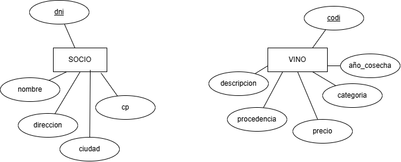

# Ejercicio

   
## 📝Ejercicio 1

Intentar sacar las entidades y atributos correspondientes a una cooperativa de vino,
con los siguientes requisitos  

  * En la cooperativa hay una serie de socios de los cuales nos interesa el nombre, dirección, ciudad, código postal, DNI, ... 

  * Hay unas clases de vino que tiene la cooperativa. De estas clases de vino queremos tener una descripción, el precio de venta, la categoría, la procedencia y el año de cosecha. 

  * Los socios retiran de la cooperativa distintas cantidades. Se les hace un vale donde tiene que constar la fecha y la cantidad retirada.

🎯 Intenta resolver el ejercicio primero sobre papel, sin miedo a equivocarte. Si lo deseas, puedes revisar posteriormente tu propuesta con la IA para detectar posibles errores y mejorarla. Una vez hayas finalizado el proceso de revisión (o si prefieres no utilizar la IA), consulta la solución y compárala con la tuya.

??? success "⏳ espera antes de ver la solución"
    