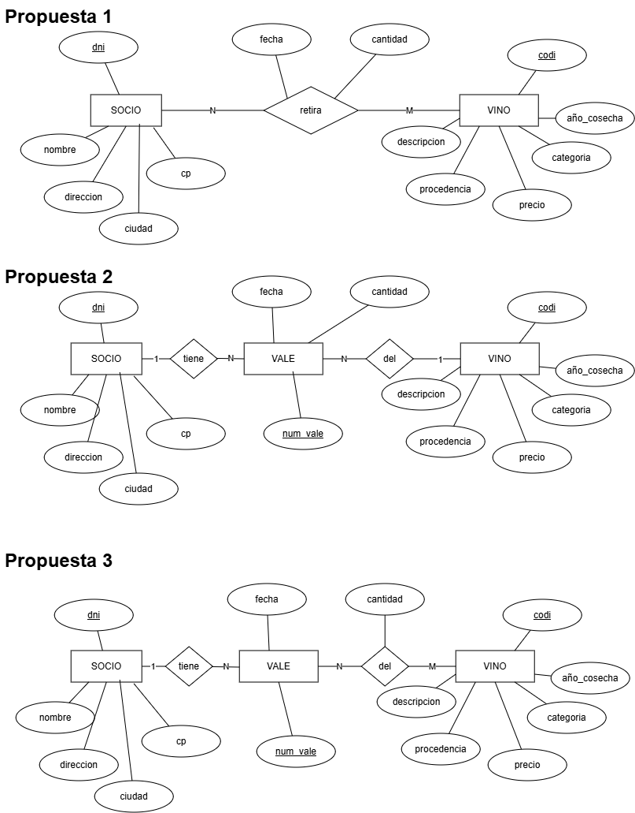
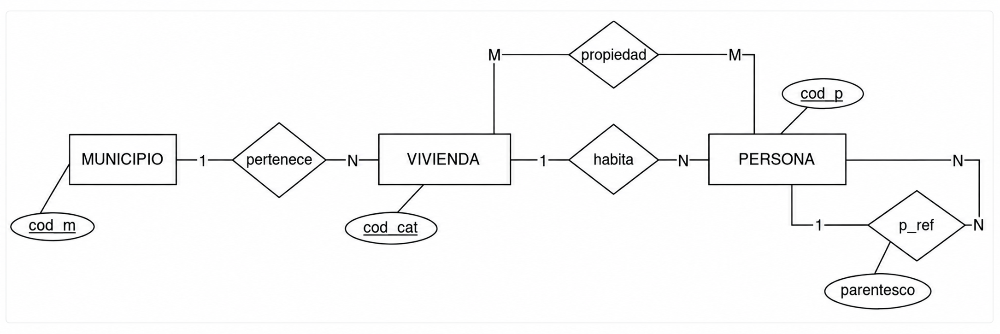
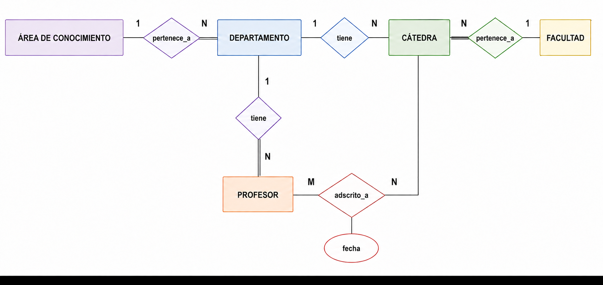
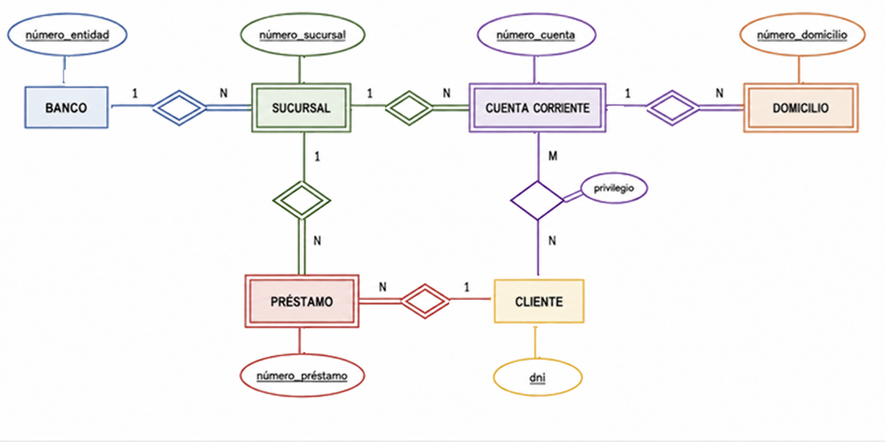
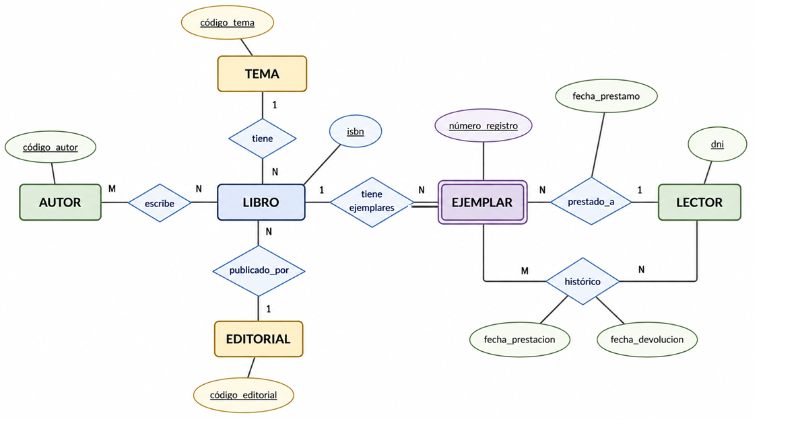
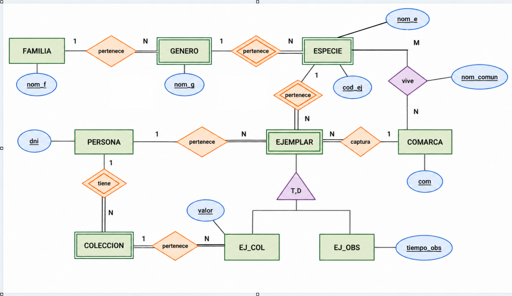

---
hide:
  - toc
---

# Soluciones

!!! warning "Advertencia"
    Antes de consultar la resolución, asegúrate de haber intentado resolver el ejercicio. Comparar tu propuesta con la solución te ayudará mucho más que leerla directamente.

??? success "Ver solución propuesta Ejercicio 1"
    * **Entidad SOCIOS**: Atributos (<u>dni</u>, nombre, dirección, ciudad, código postal, ...)
    * **Entidad CLASES_VINO**: Atributos (<u>codi</u>, descripción, precio_venta, categoría, procedencia, año_cosecha)

    
    
??? success "Ver solución propuesta Ejercicio 1 bis"

    

??? success "Ver solución propuesta Ejercicio 2"
       
    

    

??? success "Ver solución propuesta Ejercicio 3"
    { .grayscale }
    

??? success "Ver solución propuesta Ejercicio 4"
    { .grayscale }

??? success "Ver solución propuesta Ejercicio 5"
   { .grayscale }
    

??? success "Ver solución propuesta Ejercicio 6"
    { .grayscale }
