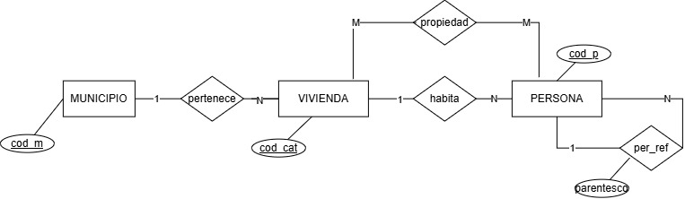
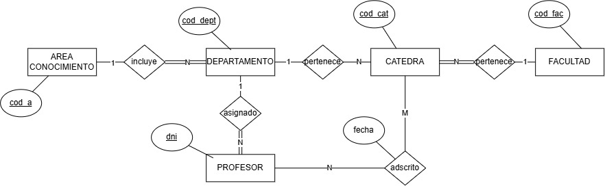
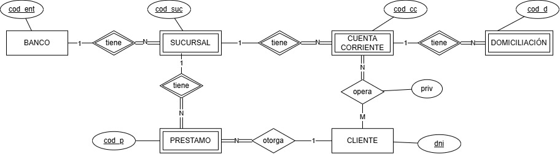
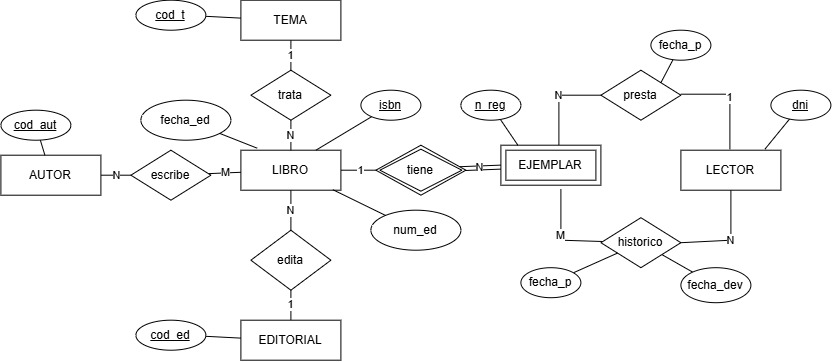
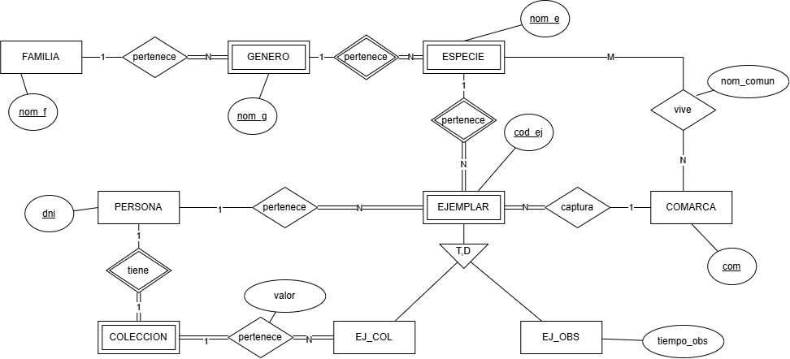

---
hide:
  - toc
---

# Soluciones

!!! warning "Advertencia"
    Antes de consultar la resolución, asegúrate de haber intentado resolver el ejercicio. Comparar tu propuesta con la solución te ayudará mucho más que leerla directamente.

??? example "Ejercicio 1"

    ??? question "Enunciado"
        Intentar sacar las entidades y atributos correspondientes a una **cooperativa de vino**, con los siguientes requisitos

          * En la cooperativa hay una serie de socios de los cuales nos interesa el nombre, dirección, ciudad, código postal, DNI, ...

          * Hay unas clases de vino que tiene la cooperativa. De estas clases de vino queremos tener una descripción, el precio de venta, la categoría, la procedencia y el año de cosecha.

          * Los socios retiran de la cooperativa distintas cantidades. Se les hace un vale donde tiene que constar la fecha y la cantidad retirada.

    ??? success "Solución propuesta"
        * **Entidad SOCIOS**: Atributos (<u>dni</u>, nombre, dirección, ciudad, código postal, ...)
        * **Entidad CLASES_VINO**: Atributos (<u>codi</u>, descripción, precio_venta, categoría, procedencia, año_cosecha)

        

??? example "Ejercicio 1 bis"

    ??? question "Enunciado"
        Diseñar el esquema E/R del ejercicio 1.

    ??? success "Solución propuesta"
        

??? example "Ejercicio 2"

    ??? question "Enunciado"
        Diseñar un esquema E/R que recoja información sobre el **padrón** de municipios, viviendas y personas. Cada persona solo puede habitar una vivienda y residir en un municipio, pero puede ser propietaria de más de una vivienda. Evidentemente, una vivienda puede tener más de un propietario. Nos interesa también la relación de las personas con la persona de referencia del hogar de la familia.

    ??? success "Solución propuesta"
        

??? example "Ejercicio 3"

    ??? question "Enunciado"
        Diseñar un esquema E/R que recoja información sobre una **universidad**. Se considera que:

          * Los departamentos (como por ejemplo el Departamento de _Lenguajes y Sistemas Informáticos_) pueden estar en una única facultad o ser interfacultativos, agrupando en este caso cátedras que pertenecen a facultades distintas.

          * Una cátedra (por ejemplo la de _Bases de Datos_) pertenece a un único departamento.

          * Una cátedra está en una única facultad.

          * Un profesor está siempre asignado a un único departamento y adscrito a una o más de una cátedra. Puede cambiar de cátedra pero no de departamento. Nos interesa la fecha en que un profesor es adscrito a una cátedra.

          * Existen áreas de conocimiento (como por ejemplo el área de _Informática_, que incluye los departamentos de _Lenguajes y Sistemas Informáticos_ y de _Ingeniería y Ciencia de los Computadores_) y todo departamento tendrá una única área de conocimiento.

    ??? success "Solución propuesta"
        { .grayscale }

??? example "Ejercicio 4"

    ??? question "Enunciado"
        El análisis de requisitos de una determinada **red bancaria** es el siguiente:

          * De cada banco nos interesa el nombre y la dirección de la sede social. Hay un código distinto para cada entidad bancaria.

          * Cada banco tiene distintas sucursales, que se identifican _internamente_ por un código.

          * Cada sucursal tiene asignados una serie de cuentas corrientes, que se identifican _internamente_ por un código. Una cuenta puede pertenecer a uno o más de un cliente. Es posible que cada cliente pueda hacer operaciones distintas con las cuentas. Así podría ser que, aunque dos clientes sean titulares de una misma cuenta, solo uno tenga facultad para cerrarla.

          * Cada cliente, que se identifica por su DNI, puede tener más de una cuenta, y evidentemente privilegios distintos en cada una de ellas.

          * Cada cuenta puede tener domiciliaciones asociadas a ella.

          * Las sucursales pueden otorgar préstamos a los clientes, que no estarán asociados a las cuentas. Cada préstamo se otorga a nombre de un único cliente, y a un cliente se le puede otorgar más de un préstamo.

    ??? success "Solución propuesta"
        { .grayscale }

??? example "Ejercicio 5"

    ??? question "Enunciado"
        Se quiere mantener información sobre una **biblioteca**, donde podemos tener de cada libro más de un ejemplar, que además se pueden prestar, y que también nos interesa un histórico de préstamos. El análisis de requerimientos sería el siguiente:

          * Cada libro (con un determinado título, ISBN, idioma, número de edición y fecha de edición) trata solo de un tema, está editado por una única editorial, escrito por uno o más autores, y dispondremos de unos cuantos ejemplares. De los ejemplares siempre tendremos el número de registro, que lo identifica unívocamente.

          * Los préstamos son de los ejemplares de los libros, que son las materializaciones de los libros. Un ejemplar se puede prestar a un único lector (del cual tendremos Dni, Nombre, Dirección y Teléfono), y nos interesa la fecha en la cual se ha prestado. Un lector puede tener más de un libro prestado.

          * Aparte del préstamo actual, querremos saber en el pasado a quién se ha prestado. Por tanto en el histórico de préstamos cada ejemplar se habrá prestado a muchos lectores, y para poder llevar el seguimiento nos interesa la fecha de préstamo y la de devolución.

    ??? success "Solución propuesta"
        { .grayscale }

??? example "Ejercicio 6"

    ??? question "Enunciado"
        Realizad el esquema E/R que recoja información de una asociación de aficionados a las **mariposas**, que quieren guardar información respecto a ejemplares capturados bien para su observación, bien para ser incluidos en una colección:

          * Como en cualquier orden natural, un ejemplar de mariposa pertenece a una especie única. Una especie pertenece a un género único, y un género a una familia natural única.

          * Cada especie de mariposa tiene un nombre científico único, aunque su nombre común, que depende de la comarca donde se ha cogido, también nos interesa.

          * Ya sea para la observación o para formar parte de una colección, primero se tiene que capturar el ejemplar de mariposa. Esta captura la realiza una única persona, y querremos saber también en qué lugar (comarca) se ha capturado. Si el ejemplar es destinado a la observación querremos saber la duración de la observación.

          * Una determinada persona solo puede ser propietaria de una colección, pero los ejemplares de esta colección pueden haber estado capturados por otras personas.

          * Se quiere mantener información de las familias, géneros y especies de mariposas aunque no se hayan capturado ejemplares de los mismos.

          * Una mariposa solo puede pertenecer a una colección, y una colección está formada al menos por un ejemplar. Toda mariposa que pertenece a una colección tendrá un determinado valor.

    ??? success "Solución propuesta"
        { .grayscale }

