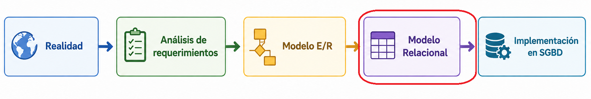

---
hide:
  - toc
---

# 1. Introducción al Modelo Relacional

???+ info "Un poco de historia"
    El modelo relacional es uno de los modelos de bases de datos más utilizados en la actualidad. Fue propuesto en **1970** por el matemático e investigador de IBM **Edgar F. Codd**, con el objetivo de organizar la información de forma estructurada, sencilla y eficiente.

    Antes de la aparición del modelo relacional, las bases de datos utilizaban principalmente modelos jerárquicos y en red. Estos sistemas eran complejos, difíciles de mantener y dependían mucho de cómo estaban almacenados físicamente los datos.

    **Codd** propuso una nueva forma de trabajar basada en las matemáticas y la teoría de conjuntos, donde la información se organizaba en **tablas relacionadas entre sí**. Cada tabla representa una entidad del mundo real y está formada por filas (tuplas o registros) y columnas (atributos o campos).  

---
Gracias al modelo relacional:

- los datos pueden organizarse de manera clara,
- se reducen las redundancias,
- se mejora la integridad de la información,
- y se facilita la realización de consultas mediante lenguajes como SQL.

Con el paso del tiempo, el modelo relacional se convirtió en el estándar de la mayoría de los sistemas gestores de bases de datos (SGBD), como MySQL, PostgreSQL, Oracle Database o Microsoft SQL Server.

En este tema estudiaremos los conceptos fundamentales del modelo relacional y cómo transformar un modelo entidad-relación en un conjunto de tablas relacionales.

---

