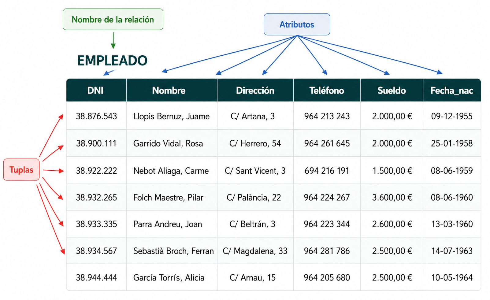
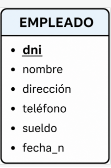

<!--
hide:
    - toc
---
-->
# 2. Estructura del Modelo Relacional

El elemento básico del Modelo Relacional es la **RELACIÓN**, que es una tabla bidimensional con características y restricciones específicas.

---

## 2.1 Componentes de una Relación

- **Nombre de la relación**

    Identificador único de la tabla (ej: EMPLEADO).
    
- **Filas (tuplas)**

    Información de cada ocurrencia o individuo.
    También llamadas registros.

- **Columnas (atributos)**

    Características de los individuos.
    También llamadas campos.

## 2.2 Definiciones Clave

| Concepto | Significado |
|----------|-------------|
| **Esquema/Estructura** | Definición de atributos, dominios y restricciones |
| **Estado de la Relación** | Información contenida en un momento específico |
| **Clave Candidata** | Atributo(s) que identifican unívocamente cada tupla |
| **Clave Principal/Primaria** | La clave candidata elegida para identificar tuplas |
| **Valor Nulo** | Ausencia de valor en un atributo (ej: sin teléfono) |
| **Dominio** | Conjunto de valores posibles para cada atributo.

## 2.3 Representaciones de Tablas

### Representación 1: Notación Textual

| Convenciones ||
|---|---|
| - Nombre de tabla en MAYÚSCULAS - Atributos en minúsculas, separados por comas - Clave principal subrayada - Evitar caracteres especiales (ñ, acentos, guiones)           ||

| Ejemplo ||
|---|---|
| EMPLEADO (<u>dni</u>, nombre, direccion, telefono, sueldo, fecha_n)||
    
### Representación 2: Diagrama Visual

| Convenciones | Ejemplo ||
|---|---|---|
| Una tabla con: - Nombre en la parte superior - Atributos listados en el interior - Clave principal en negrita o subrayada |  ||

---