# 3. Transformación del M. E/R al M. Relacional
<!--
<iframe src="../presentacion_parte_1.pdf" width="100%" height="800px" style="border-radius: 8px; box-shadow: 0 4px 6px -1px rgba(0, 0, 0, 0.1); border: none;">
</iframe>

Si no ves el visor de arriba o prefieres leerlo aparte: 
🎓 **[Descargar Presentación Parte 1 (PDF)](presentacion_parte_1.pdf)**
-->

A continuación veremos las reglas de transformación del Modelo E/R al Modelo Relacional, de esta manera continuamos el proceso de diseño de una Base de Datos. 

!!!Tip "Reglas de transformación"
    
    - Las entidades pasan a ser tablas
    - Los atributos pasar a ser columnas
    - Los atributos identificadores pasar a ser claves primarias.
    - Los atributos de las relaciones pasan a columnas detrás de las claves ajenas
    - Las relaciones, dependiendo de la cardinalidad, pasarán a ser claves ajenas y/o tablas.

!!!Note ""
    Para entender mejor el proceso, continuaremos utilizando el ejemplo visto en el tema anterior y aplicaremos sobre él las transformaciones correspondientes, utilizando la **notaión textual**.

???+ "Ejemplo: Empresa"
    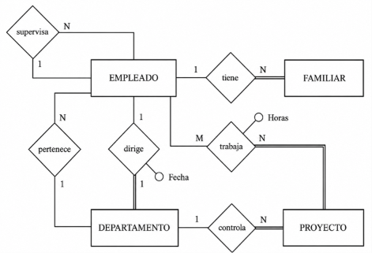

## 3.1 Entidades

Toda entidad se transformará en una tabla, con todos sus atributos, que se considerarán como simples. Se elige uno (o un conjunto) como clave principal, y lo denotaremos subrayándolo. Las entidades débiles las estudiaremos mejor más adelante.

En nuestro ejemplo, como teníamos 4 entidades, nos saldrán de momento 4 tablas:

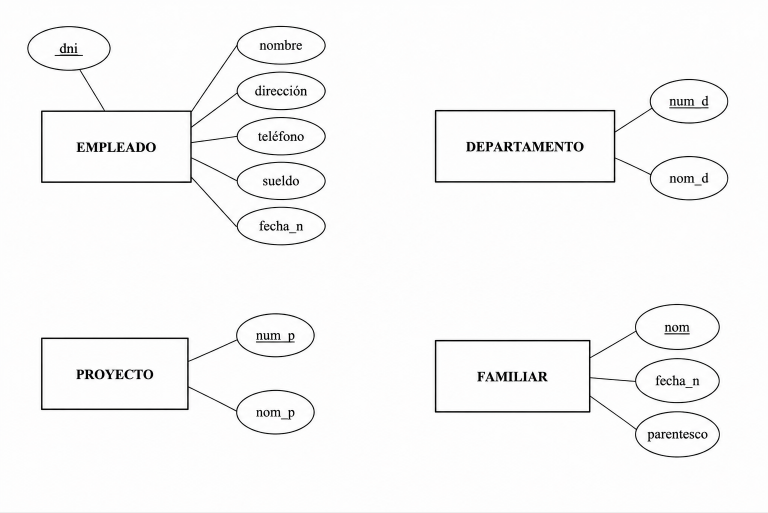

!!! quote ""
    - EMPLEADO (<u>dni</u>, nombre, direccion, telefono, sueldo, fecha_n, departamento, supervisor)
    - DEPARTAMENTO (<u>num_d</u>, nombre_d)
    - PROYECTO (<u>num_p</u>, nombre_p, departamento)
    - FAMILIAR (<u>nombre</u>, fecha_n, parentesco, dni_e)

<!---->

## 3.2 Relaciones 1:N

La clave primaria de la entidad con cardinalidad máxima 1 (A) se incluye en la entidad con cardinalidad máxima N (B) como clave externa que apuntará a la clave principal de A.  
En muchas ocasiones al campo nuevo de B se le pone el mismo nombre que a la clave principal de A, pero es opcional.

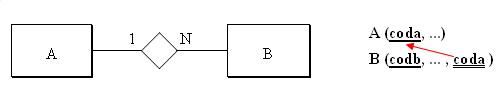

<!--
La siguiente animación intenta explicarlo mejor:

<iframe src="https://slides.com/aliciasalvador/bd-t3-exemple_clau_externa/embed" width="576" height="420" title="Copy of BD-T3-exemple_clau_externa" scrolling="no" frameborder="0" webkitallowfullscreen mozallowfullscreen allowfullscreen></iframe>
  
Si además la entidad que participa con grado N lo hace de forma **total** (como en la figura de abajo), la clave externa **no puede ser nula** (es decir siempre ha de tener un valor).

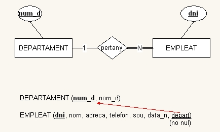
-->
Las relaciones 1:N de nuestro **ejemplo** se representarían así:

<!--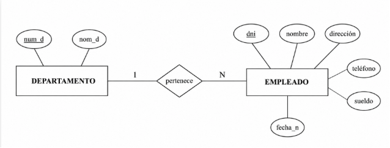-->

???+ "Ejemplo: Empresa"
    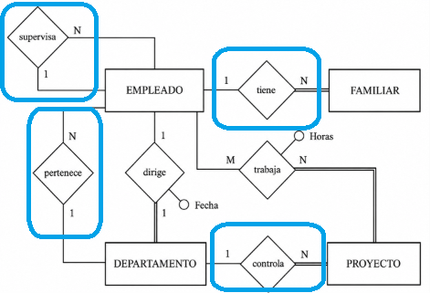

!!! quote ""
    - EMPLEADO (<u>dni</u>, nombre, direccion, telefono, sueldo, fecha_n, <mark>departamento</mark>, <mark>supervisor</mark>)
        - departamento -> DEPARTAMENTO (num_d) [no nulo]
        - supervisor -> EMPLEADO (dni)
    - DEPARTAMENTO (<u>num_d</u>, nombre_d)
    - PROYECTO (<u>num_p</u>, nombre_p, <mark>departamento</mark>)
        - departamento -> DEPARTAMENTO (num_d) [no nulo]
    - FAMILIAR (<u>nombre</u>, fecha_n, parentesco, <mark>dni_e</mark>)
        - dni_e -> EMPLEADO (dni) [no nulo]

  * Por la relación **_Pertenece_** (figura de arriba) incluiremos el atributo **departamento** a **Empleado**, que además deberá ser no nulo.

  * Por la relación **_Controla_** incluiremos el atributo **departamento** a **Proyecto** (no nulo).

  * Por la relación **_Supervisa_** incluiremos el atributo **supervisor** a **Empleado** (es reflexiva), pero este sí que puede ser nulo. Aunque parezca extraño, un campo puede ser clave externa que apunta a la clave principal de la misma tabla.

  * Por la relación **_Tiene_** entre empleado y familiar, incluiremos en **FAMILIAR** el atributo **dni_e**, pero como Familiar es débil la veremos mejor un poco más adelante.

## 3.3 Relaciones M:N

Por cada relación **M:N** se crea una **tabla intermedia**.

En esa tabla:

- Las claves principales de las dos entidades pasan a ser **claves externas**.
- La combinación de esas claves externas forma la **clave principal** (o parte de ella).
- Se añaden también los atributos propios de la relación.

### Ejemplo base

Relación M:N entre **EMPLEADO** y **PROYECTO**, con atributo **horas**:

La traducción al modelo relacional queda:

!!! quote ""
    - TRABAJA (<mark><u>dni, num_p</u></mark>, horas)
        - dni -> EMPLEADO (dni)
        - num_p -> PROYECTO (num_p)

### ¿Cuándo no basta con la clave compuesta?

Pregunta clave: **¿puede repetirse la combinación `(dni, num_p)` en diferentes momentos?**

- Si **no** puede repetirse, la clave compuesta `(dni, num_p)` es suficiente.
- Si **sí** puede repetirse (caso histórico), hay que añadir otro atributo a la clave principal.

En el ejemplo histórico:

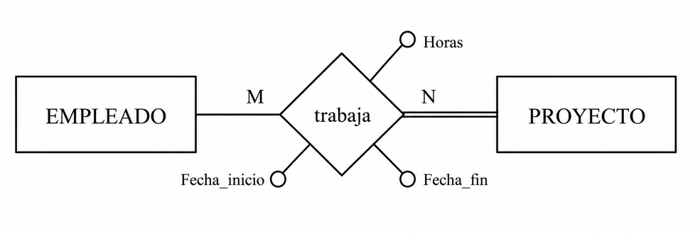

Se añade **fecha_inicio** a la clave principal para diferenciar participaciones distintas del mismo empleado en el mismo proyecto:

!!! quote ""
    - TRABAJA (<mark><u>dni, num_p</mark>, fecha incio</u>, fecha_fin, horas)
        - dni -> EMPLEADO (dni)
        - num_p -> PROYECTO (num_p)

### Criterio práctico

Evita claves principales excesivamente largas. Como regla práctica, si la clave principal empieza a tener demasiados campos (por ejemplo, 4 o más), conviene usar una clave artificial (como `id_trabaja`) y mantener las claves externas igualmente.

## 3.4 Relaciones 1:1

No existe una única traducción para una relación **1:1**. La decisión depende de la participación (**total** o **parcial**) y del criterio práctico de diseño.

### Caso 1: Una entidad participa de forma total

Si entre **A** y **B** solo una entidad participa de forma total (por ejemplo, **B**), la traducción recomendada es:

- Añadir una **clave externa** en **B**.
- Marcarla como **no nula** (siempre que la participación sea total).
- Marcarla como **única** para mantener el 1:1.
- Añadir en esa tabla los atributos de la relación.

Ejemplo **dirige** (EMPLEADO - DEPARTAMENTO):

La opción elegida es colocar la clave externa en **DEPARTAMENTO**:  
Todos los departamentos tienen director (no nula) y solo uno (única), pero no todos los empleados dirigen un departamento.

!!! quote ""
    - DEPARTAMENTO (<u>num_d</u>, nom_d, <mark>director</mark>, Fecha)
        - director -> EMPLEADO (dni) [no nulo] [unico] 

### Caso 2: Ambas entidades participan de forma total

Se puede:

- Fusionar todo en una sola tabla (entidades + relación + atributos), o
- Mantener dos tablas y aplicar el caso 1 (clave externa en una de ellas).

Ejemplo:

!!! quote ""
    - PERSONA (<u>dni</u>,....(datos persona)....(datos colección)...)

### Caso 3: Ambas entidades participan de forma parcial

Si en cualquiera de las dos tablas habría demasiados nulos, conviene crear una **tabla intermedia de relación**.

Ejemplo:

Traducción:

!!! quote ""
    - PERSONA (<u>dni</u>, ...(datos persona)...)
    - COLECCION (<u>cod_col</u>, ...(datos colección)...)
    - PROPIETARIO (<mark><u>dni, cod_col</u></mark>)
        - dni -> PERSONA (dni)
        - cod_col -> COLECCION (cod_col)

Si una participación es "casi total", puede seguir siendo más eficiente usar clave externa (caso 1), aceptando algunos nulos.

### Regla práctica

En la mayoría de escenarios reales, una relación **1:1** se traduce mejor como **clave externa en la tabla con participación total o casi total**.

## 3.5 Entidades débiles

Una entidad débil depende de una entidad principal para existir. Por eso, su traducción al modelo relacional es más estricta.

### Reglas clave

- Debe tener una **clave externa no nula** hacia la entidad principal.
- La participación es total: cada fila de la entidad débil debe estar vinculada a una fila de la entidad principal.

### Tipos de dependencia

- **Dependencia en existencia**:
  la clave externa debe **actualizar y borrar en cascada**.
- **Dependencia en identificación**:
  además, la clave externa **forma parte de la clave principal**.

### Nota práctica

- Si la relación identificadora es **1:N**, normalmente hace falta otro atributo para completar la clave principal.
- Si es **1:1**, la clave externa puede ser suficiente como clave principal.

En el ejemplo:

!!! quote ""
    - FAMILIAR (<u><mark>dni_e</mark>, nom_f</u>, fecha_n, parentesco  (borrar en cascada)
        - dni_e -> PERSONA (dni)

## 3.6 Resumen dependencias

Resumen de cómo se traduce cada grado de dependencia al modelo relacional:

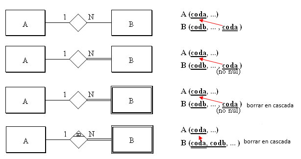

**Caso particular**: si una entidad débil depende en identificación mediante una relación **1:1**, la clave principal de **A** puede pasar directamente a ser clave principal de **B**.

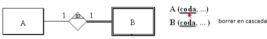

### Claves externas compuestas

Una duda frecuente aparece cuando la tabla referenciada tiene clave principal de varios campos.

Ejemplo: la tabla **FAMILIAR** tiene clave principal compuesta. Si otra tabla depende de ella (por ejemplo, cartas/comunicaciones), la relación en el modelo E/R podría ser:

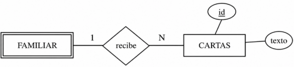

Si la relación es 1:N, la tabla dependiente tendrá una **clave externa compuesta** por esos dos campos.

Importante:

- No son dos claves externas separadas.
- Es **una única clave externa compuesta**.

!!! quote ""
    - FAMILIAR (<u><i>dni_e</i>, nom_f</u>, fecha_n, parentesco  (borrar en cascada)
        - dni_e -> PERSONA (dni)
    - CARTAS (<u>id</u>, texto, <mark>dni_e, nom_f</mark>)
        - dni_e, nom_f -> FAMILIAR (dni_e, nom_f)

## 3.7 Relaciones ternarias

En una relación ternaria (o de grado superior) se crea una **tabla nueva** para representar la relación.

### Regla general

- La nueva tabla incluye como **claves externas** las claves primarias de todas las entidades participantes.
- También incluye los atributos propios de la relación.
- Habitualmente, la clave principal es la combinación de esas claves externas.

### Ajuste por cardinalidad

Si alguna entidad participa con cardinalidad máxima 1, su clave puede no formar parte de la clave principal de la tabla de relación.

### Ejemplo

En el ejemplo ternario, con atributos como **fecha de compra** y **cantidad**:

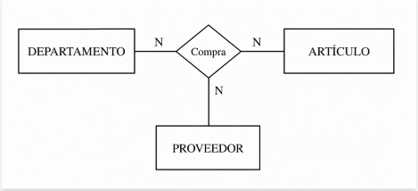

!!! quote ""
    - DEPARTAMENTO (<u>num_d</u>, ....)
    - ARTICULO (<u>cod_art</u>, ....)
    - PROVEEDOR (<u>cod_pr</u>, ....)
    - COMPRA (<u><mark>num_d</mark>, <mark>cod_art</mark>, <mark>cod_pr</mark>, fecha_c </u>, cantidad) 
        - num_d -> DEPARTAMENTO (num_d)
        - cod_art-> ARTICULO (cod_art)
        - cod_pr-> PROVEEDOR (cod_pr)

Como todas las entidades participan con N, inicialmente todas sus claves externas forman parte de la clave principal. Sin embargo, puede no ser suficiente si una combinación puede repetirse en el tiempo (por ejemplo, mismo departamento, artículo y proveedor en compras distintas).

En ese caso hay dos opciones:

- Añadir otro atributo diferenciador a la clave principal.
- Sustituir la clave principal por una clave artificial cuando la compuesta se vuelve demasiado larga.

Las claves externas se mantienen y, normalmente, son no nulas:

!!! quote ""
    - DEPARTAMENTO (<u>num_d</u>, ....)
    - ARTICULO (<u>cod_art</u>, ....)
    - PROVEEDOR (<u>cod_pr</u>, ....)
    - COMPRA (<u>id</u>,<mark>num_d</mark>, <mark>cod_art</mark>, <mark>cod_pr</mark>, fecha_c , cantidad) 
        - num_d -> DEPARTAMENTO (num_d) [no nulo]
        - cod_art-> ARTICULO (cod_art) [no nulo]
        - cod_pr-> PROVEEDOR (cod_pr) [no nulo]

## 3.8 Especializaciones

Las especializaciones no tienen una única traducción óptima. La solución teórica puede ser correcta, pero en la práctica puede generar demasiadas tablas y mayor mantenimiento.

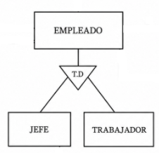

### Opción 1: Mantener superclase y subclases

Cada subclase se traduce a su propia tabla, heredando la clave principal de la superclase y añadiendo sus atributos específicos. Suele ser útil incluir un atributo de tipo en la superclase.

En el ejemplo:

!!! quote ""
    - EMPLEADO (<u>dni</u>,nombre, direccion, telefono,..., tipo)
    - JEFE (<u><mark>dni</mark></u>, opinion)
        - dni -> EMPLEADO (dni)
    - TRABAJADOR (<u><mark>dni</mark></u>, horas_extra)
        - dni -> EMPLEADO (dni)

### Opción 2: Simplificar subclases

Los atributos de las subclases pasan a la superclase. También se adaptan las relaciones asociadas a las subclases. En este caso, el campo que identifica el tipo es obligatorio.

!!! quote ""
    - EMPLEADO (<u>dni</u>,nombre, direccion, telefono,... tipo, opinion, horas_extra)

### Opción 3: Simplificar superclase

Los atributos de la superclase se reparten entre las subclases. Las relaciones también se trasladan a cada subclase, ajustando las participaciones.

!!! quote ""
    - EMPLEADO (<u>dni</u>)
    - JEFE (<u><mark>dni</mark></u>, nombre, direccion, telefono,..., opinion)
        - dni -> EMPLEADO (dni)
    - TRABAJADOR (<u><mark>dni</mark></u>, nombre, direccion, telefono,..., horas_extra)
        - dni -> EMPLEADO (dni)
        

### Criterio práctico

Elige la opción que mejor equilibre claridad del modelo, volumen de datos y coste de mantenimiento.

## 3.9 Restricciones externas

Ya hemos comentado que restricciones externas son restricciones que no se pueden expresar por medio del modelo de datos. Entonces las expresaremos de palabra.

Normalmente, las restricciones externas del Modelo E/R continuarán siéndolo en el Modelo Relacional, porque tampoco se podrán expresar. En nuestro ejemplo teníamos las restricciones externas del Modelo E/R:

> **Rex1**: El jefe de un departamento debe ser miembro de este.

> **Rex2**: Un empleado solo puede trabajar en proyectos coordinados por su departamento.

Esto tampoco se puede expresar con el Modelo Relacional, por lo tanto las mantendremos.

Aparte, se pueden crear más restricciones externas, porque con el Modelo Relacional no se puede expresar todo lo que se podía expresar con el Modelo E/R. Por ejemplo, en la relación:

ya hemos comentado que dará lugar, aparte de las tablas de las entidades, a otra tabla:

!!! quote ""
    - TRABAJA (<u><mark>dni</mark>, <mark>num_p</mark></u>, horas)
        - dni -> EMPLEADO (dni)
        - num_p -> PROYECTO (num_p)

donde **dni** y **num_p** son claves externas. Pero la entidad proyecto participa de forma total en la relación, es decir, en todo proyecto debe haber un empleado trabajando. ¿Cómo controlamos esto? Pues es una nueva restricción externa que la podríamos formular así:

> **RexR3**: Todo proyecto debe tener como mínimo un empleado trabajando en él.

Las participaciones totales que nos supondrán una restricción externa son:

  * En una relación **1:N**, una participación total de la entidad que participa con grado 1.
  

  * En una relación **M:N**, cualquier participación total (si las dos participan de forma total, entonces habrá dos restricciones externas).
  

  * En una relación **1:1**, depende de la manera de traducirse.

La manera de implementar las restricciones externas será por medio de un TRIGGER, que se active cuando haya una actualización (inserción, modificación o borrado) que afecte a la restricción externa. Por ejemplo, en la restricción **RexR3** los momentos importantes son después de insertar un nuevo proyecto, y antes de eliminar o modificar en la tabla **Trabaja** (por si un proyecto se queda sin gente trabajando en él).

Las acciones a desarrollar podrían ser sacar un aviso, o obligar a insertar como mínimo una tupla en la tabla **Trabaja**, en el caso de la inserción de un nuevo proyecto; en el caso de modificación o eliminación en **Trabaja** podría impedirse esta actualización.

En nuestro ejemplo tendremos las restricciones externas al Modelo Relacional:

> **RexR1**: El jefe de un departamento debe ser miembro de este.

> **RexR2**: Un empleado solo puede trabajar en proyectos coordinados por su departamento.

> **RexR3**: Todo proyecto debe tener como mínimo un empleado trabajando en él.

## 3.10 Ejemplo

Vamos a ver cómo quedará definitivamente la traducción del ejemplo que estamos arrastrando desde el Tema 2. Daremos 2 versiones, teniendo en cuenta o no la especialización de que el trabajador puede ser jefe o trabajador normal.

Sin tener en cuenta la especialización tendremos esta solución:

!!! quote ""
    - EMPLEADO (<u>dni</u>, nombre, direccion, telefono, sueldo, fecha_n, <mark>departamento</mark>, <mark>supervisor</mark>)
        - departamento -> DEPARTAMENTO (num_d) [no nulo]
        - supervisor -> EMPLEADO (dni)
    - FAMILIAR (<u><mark>dni_e</mark>, nombre_f</u>, fecha_n, parentesco, ) (borrar en cascada)
        - dni_e -> EMPLEADO (dni)   
    - DEPARTAMENTO (<u>num_d</u>, nombre_d, <mark>director</mark>, fecha)
        - director -> EMPLEADO (dni) [no nulo] [unico]
    - PROYECTO (<u>num_p</u>, nombre_p, <mark>departamento</mark>)
        - departamento -> DEPARTAMENTO (num_d) [no nulo]
    - TRABAJA (<u><mark>dni</mark>, <mark>num_p</mark></u>, horas)    
        - dni -> EMPLEADO (dni)
        - num_p -> PROYECTO (num_p)
    

Y esta sería la forma alternativa de representarlo:

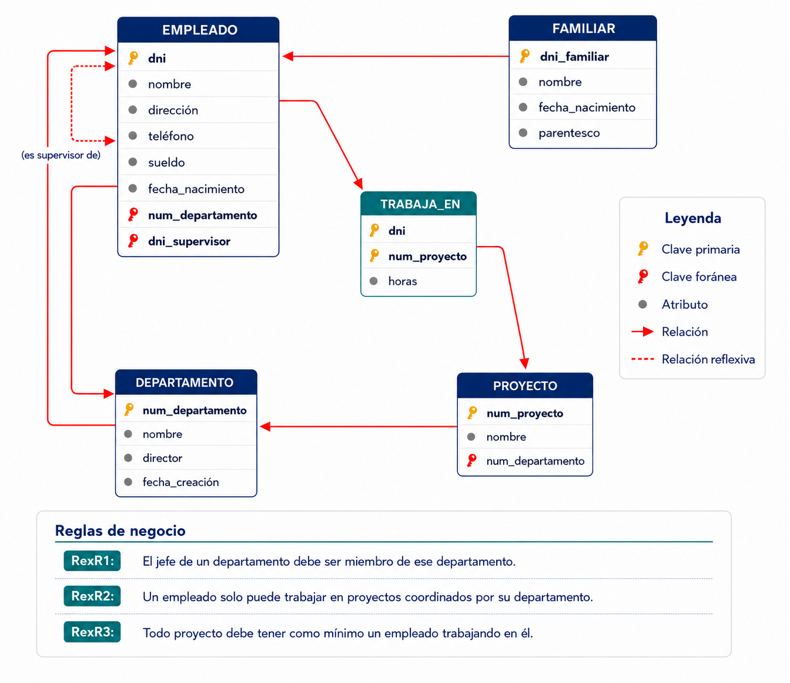{width=600}

Y teniendo en cuenta la especialización:

!!! quote ""
    - EMPLEADO (<u>dni</u>, nombre, direccion, telefono, sueldo, fecha_n, <mark>departamento</mark>, <mark>supervisor</mark>)
        - departamento -> DEPARTAMENTO (num_d) [no nulo]
        - supervisor -> EMPLEADO (dni)
    - JEFE (<u><mark>dni</mark></u>, opinion)
        - dni -> EMPLEADO (dni)
    - TRABAJADOR  (<u><mark>dni</mark></u>, horas_extra) 
        - dni -> EMPLEADO (dni)     
    - FAMILIAR (<u><mark>dni_e</mark>, nombre_f</u>, fecha_n, parentesco, ) (borrar en cascada)
        - dni_e -> EMPLEADO (dni)   
    - DEPARTAMENTO (<u>num_d</u>, nombre_d, <mark>director</mark>, fecha)
        - director -> JEFE (dni) [no nulo] [unico]
    - PROYECTO (<u>num_p</u>, nombre_p, <mark>departamento</mark>)
        - departamento -> DEPARTAMENTO (num_d) [no nulo]
    - TRABAJA (<u><mark>dni</mark>, <mark>num_p</mark></u>, horas)    
        - dni -> EMPLEADO (dni)
        - num_p -> PROYECTO (num_p)
    

Y aquí tendríamos la representación alternativa:

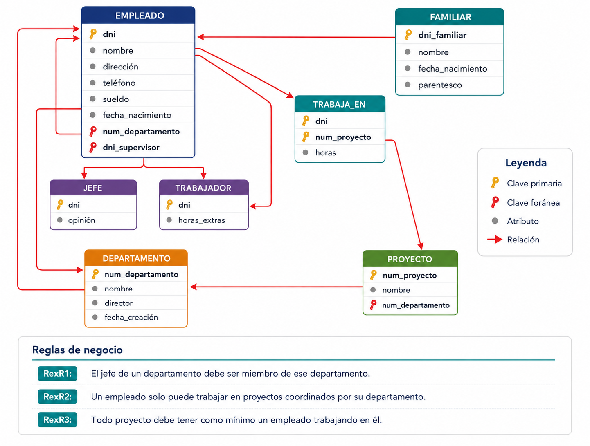{width=600}