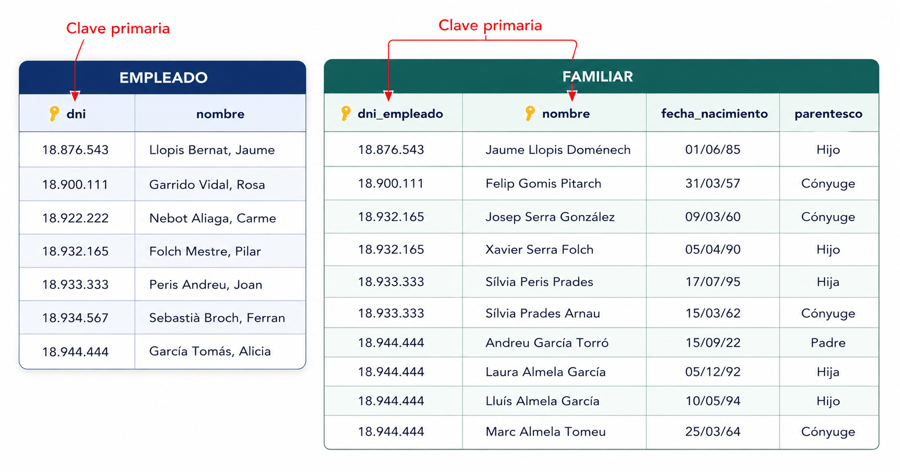
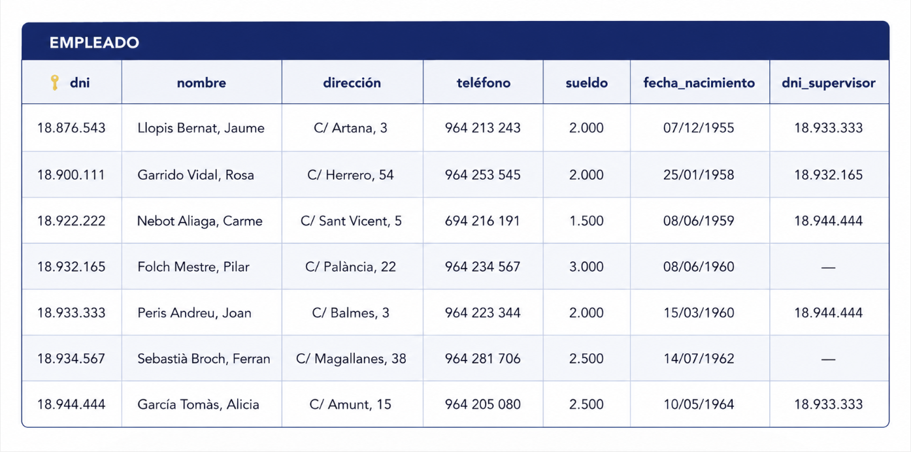

# 4. Restricciones

El Modelo Relacional define restricciones que garantizan la integridad de los datos. Hay dos tipos: **inherentes** (impuestas por el modelo) y **de usuario** (definidas por los diseñadores).

---

## 4.1 Restricciones Inherentes

Son impuestas por el propio Modelo Relacional. Toda relación válida debe cumplirlas:

### 1. Valores Atómicos

- Cada valor debe ser **simple e indivisible**
- NO se permiten atributos compuestos o multivaluados
- Excepto si se definen como campos simples separados

!!! example "Ejemplo"
    ❌ Nombre = "Juan García López" (compuesto)
    
    ✅ Nombre = "Juan", Apellido1 = "García", Apellido2 = "López" (atómicos)

### 2. Tuplas Distintas

- **No pueden haber tuplas duplicadas** en una relación: Cada fila debe ser única y representar una única ocurrencia de la entidad. Para garantizar esta unicidad se utilizan las **claves primarias**.

### 3. Orden No Significativo

- El **orden de las tuplas no importa**
- El **orden de los atributos no importa**
- Los datos se acceden por contenido, no por posición

---

## 4.2 Restricciones de Usuario (Semánticas)

Define el usuario para garantizar que la BD represente la realidad y evite errores.

### 4.2.1 Restricción de Dominio

Especifica qué valores puede tomar un atributo.

| Aspecto | Descripción |
|--------|-------------|
| **Tipo de dato** | Entero, real, texto, fecha, hora, etc. |
| **Rango** | Intervalo permitido (ej: nota 0-10) |
| **Enumeración** | Valores específicos permitidos |

!!! info "Ejemplo"
    - Sueldo: Real (rechaza "2.R00")
    - Fecha: Formato DD-MM-YYYY (rechaza "31-2-1958")
    - Nota: {MD, IN, SUF, BI, NOT, SOB}

### 4.2.2 Restricción de Clave Principal

Define un atributo (o conjunto) como **identificador único** de cada tupla.

**Características**:  

- No puede ser nulo
- No puede repetirse
- Debe ser simple (máximo 3 campos)

**Representación**:

!!! quote ""
    - EMPLEADO (<u>dni</u>, nombre, direccion, telefono, sueldo, fecha_n)

!!! tip "Buena Práctica"
    Si no existe una clave natural candidata, crear un campo artificial (ID, código, etc.)

### 4.2.3 Restricción de Unicidad

Asegura que un campo (o conjunto) no se repita, **sin ser clave principal**.

!!! info "Cuándo usarla"
    Cuando algunos valores pueden ser nulos pero, si existen, deben ser únicos.
    
    Ejemplo: Email de empleado (algunos sin email, pero no hay dos iguales)

**Representación**:

!!! quote ""
    - EMPLEADO (<u>dni</u>, nombre, email)
        - email [unico]

### 4.2.4 Restricción de Valor No Nulo

Obliga a que el atributo **siempre tenga un valor**.

!!! example "Ejemplos"
    - Nombre: siempre obligatorio
    - Dirección: puede ser nula si vive en el extranjero
    - DNI: puede ser nulo si es extranjero 

    
!!! quote ""
    - EMPLEADO (<u>dni</u>, nombre, direccion, telefono, sueldo, fecha_n)
        - nombre  [no nulo]

### 4.2.5 Integridad Referencial

Garantiza que los valores de una clave externa solo apunten a registros existentes en la tabla referenciada.

Si en **FAMILIAR** existe `dni_empleado` como clave externa hacia `EMPLEADO.dni`, no puede aparecer un `dni_empleado` que no exista en EMPLEADO.

!!! example "Ejemplo"
    No es válido insertar en FAMILIAR el DNI `18.754.321` si no existe antes en EMPLEADO.

También puede haber claves externas reflexivas (la misma tabla se referencia a sí misma), por ejemplo el atributo `supervisor` en EMPLEADO.

### 4.2.6 Acciones sobre claves ajenas

Cuando se borra o modifica una clave referenciada, suelen definirse estas acciones:

- **NO ACTION**: bloquea la operación si rompe integridad.
- **CASCADE**: propaga el cambio o borrado en cascada.
- **SET NULL / SET DEFAULT**: sustituye el valor de la clave externa por nulo o por defecto.

---

### 4.2.6 Restricciones Externas

Hay reglas de negocio que no se expresan directamente con las restricciones estándar del modelo relacional.

Estas restricciones externas suelen provenir del modelo E/R o de condiciones de negocio específicas.

!!! note "Implementación habitual"
    Muchos SGBD resuelven estas reglas mediante **disparadores (TRIGGERS)**, ejecutando lógica definida por el usuario tras inserciones, actualizaciones o borrados.