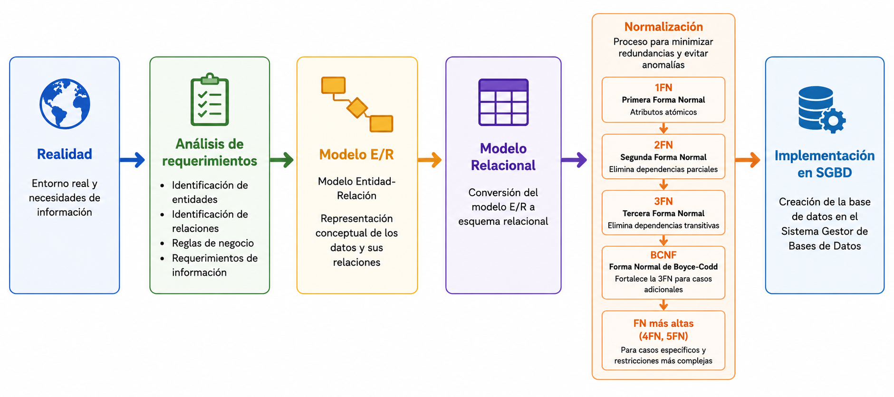

---
hide:
  - toc
---
# 1. Introducción a la Normalización

La **normalización** es el proceso que garantiza que los datos estén correctamente organizados en tablas, eliminando redundancias y asegurando la integridad.

Debemos ser conscientes, sin embargo, de que si la Base de Datos está bien diseñada desde el principio, estará prácticamente normalizada. La utilidad real de la normalización será cuando partamos de una Base de Datos directamente importada de un sistema de ficheros (un fichero → una tabla), donde normalmente estará muy mal diseñada.

## ¿Qué es la Normalización?

La normalización aplica una serie de reglas (formas normales) para transformar un esquema relacional en una estructura óptima, donde:

- Los datos son **independientes de las aplicaciones**
- Se obtiene el **máximo número de tablas posibles**
- Cada tabla contiene los atributos necesarios para una entidad o relación

---

## Beneficios de la Normalización

- 📋 **Facilidad de Uso**

    Datos agrupados en tablas que identifican claramente entidades y relaciones.

- 🔄 **Flexibilidad**

    Múltiples vistas combinando tablas mediante operaciones del álgebra relacional.

- 🛠️ **Implementación Simple**

    Las tablas resultantes son simples y fáciles de implementar.

- ✨ **Claridad**

    Representación clara y sencilla de la información para usuarios.

- 🗑️ **Redundancia Mínima**

    Información no duplicada innecesariamente en estructuras.

- ⚡ **Máximo Rendimiento**

    Solo se procesa la información útil para cada aplicación.

---
## Cuándo se aplica la Normalización

La normalización se aplica después de completar todo el ciclo de diseño:

!!! info "Nota"
    Las tablas obtenidas del esquema relacional suelen estar bastante normalizadas, pero es recomendable analizarlas todas.

