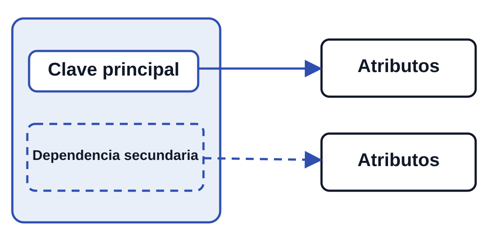
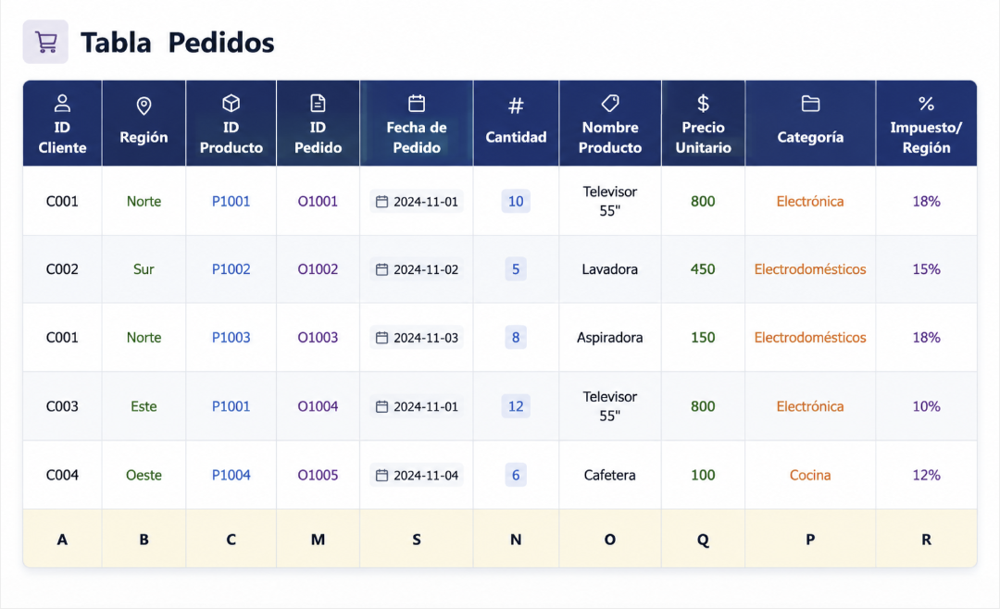
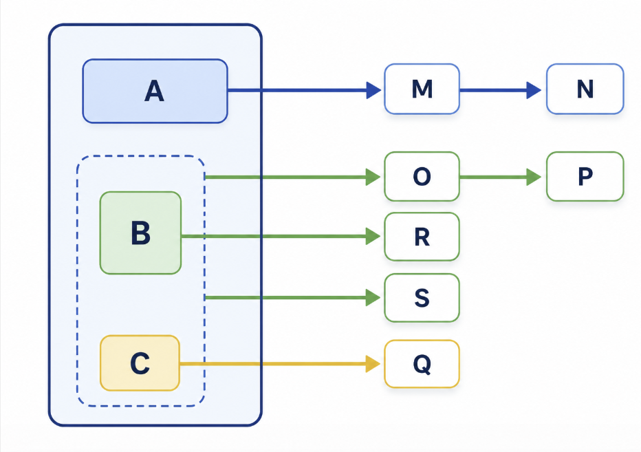

# 3. Dependencia Funcional

## 3.1 Dependencia Funcional

    
Dependencia funcional (A → B)
    

    Existe una dependencia funcional entre dos conjuntos de atributos cuando el valor de uno de ellos determina de forma única el valor del otro. 
    Se representa mediante:   

       
 CA → B 

    y se lee:   

        
&emsp;"A determina funcionalmente a B".

    

---

## Ejemplos de Dependencias

### Dependencia Unidireccional

!!! example "DNI → NOMBRE"
    Cada DNI tiene un único NOMBRE.
    El inverso NO siempre se cumple (dos personas pueden tener el mismo nombre).

### Dependencia Bidireccional

!!! example "DNI ↔ NOMBRE"
    Si es garantizado que no hay nombres duplicados.
    Cada DNI tiene un único NOMBRE y viceversa.

### Dependencia sobre Conjunto de Atributos

!!! example "DNI . EMPRESA → SUELDO"
    Un empleado tiene múltiples sueldos (uno por empresa).
    Solo DNI + EMPRESA juntos determinan SUELDO único.
    DNI solo NO determina SUELDO.

---

## Notación

- **X → Y**

    Cada valor de X tiene único valor de Y.

- **X ↔ Y**

    Dependencia bidireccional.
    La relación funciona en ambas direcciones.

- **X . Y → Z**

    X e Y determinan funcionalmente a Z.

- **X → Y | Z**

    X determina Y "o también" Z.

---

## 3.2 Dependencia Funcional Total

    
Dependencia funcional Total

Una dependencia funcional es total cuando un atributo depende de todos los atributos de una clave compuesta y no solo de una parte de ella.

### Ejemplo de Dependencia Parcial

!!! warning "Dependencia Parcial (NO deseable)"

    **DNI . EMPRESA → NOMBRE**
    
    NOMBRE solo depende de DNI, no de EMPRESA.
    Esta es una **dependencia parcial** (unos atributos son irrelevantes).

### Ejemplo de Dependencia Total

!!! success "Dependencia Funcional Total (deseable)"
    **DNI . EMPRESA → SUELDO**
    
    SUELDO requiere tanto DNI como EMPRESA.
    Sin EMPRESA, no se puede determinar SUELDO.

---

## 3.3 Grafo de Dependencias Funcionales

Es una representación visual que muestra gráficamente las relaciones entre atributos.

### Estructura del Grafo

**Estructura del grafo**

| Elemento | Representación |
|----------|----------------|
| **Clave Principal** | Recuadro con línea continua |
| **Atributos clave** | Dentro del recuadro |
| **Otros atributos** | Fuera del recuadro |
| **Dependencias secundarias** | Recuadro con línea discontinua |

**Representación visual**

{ width=400 }

El grafo permite visualizar:  

- Qué atributos se determinan mutuamente
- Qué dependencias son parciales o totales
- La cohesión de los datos

### Ejemplo

Esta tabla refleja un conjunto de pedidos y cumple con las dependencias funcionales especificadas:

* A,B,C→M,S: La combinación del **ID Cliente, Región e ID Producto** determina de manera única el **ID Pedido y la Fecha de Pedido**. 
* M→N: Cada **ID de Pedido** tiene una cantidad asociada (**Cantidad**). 
* B,C→O,R: La combinación de **Región e ID Producto** determina de manera única el **Nombre del Producto y el Precio Unitario** (puede variar según la región). 
* O→P: El **Nombre del Producto** determina su **Categoría**. 
* C→Q: El **ID de Producto** determina el **Impuesto por Región**, ya que depende del tipo de producto. 

**Dependencias**

**A . B . C** →**M | S**  
**M** →**N**  
**B . C** →**O | R**  
**O** →**P**  
**C** →**Q**  
**(clave = A . B . C)**

**Grafo asociado**

{ width=400 }

