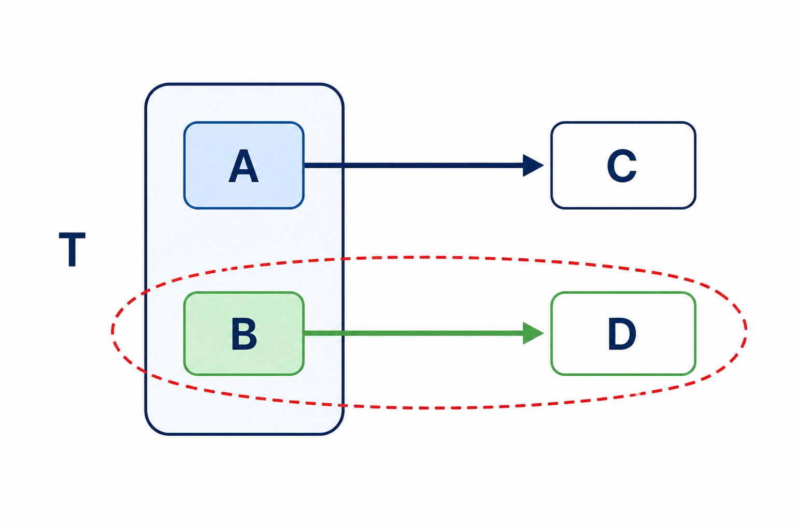
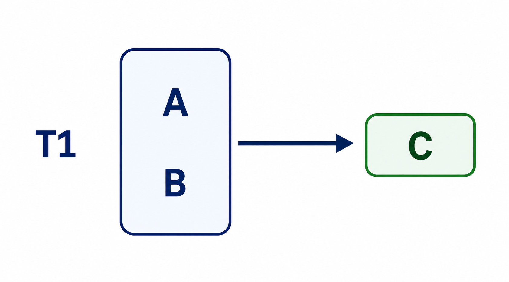
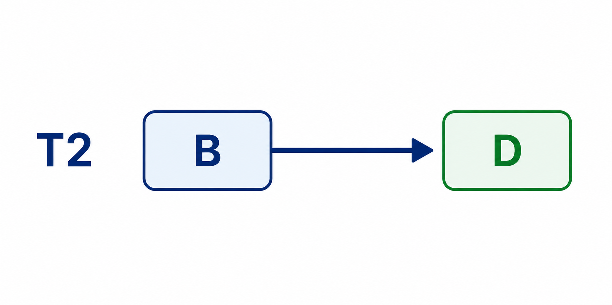
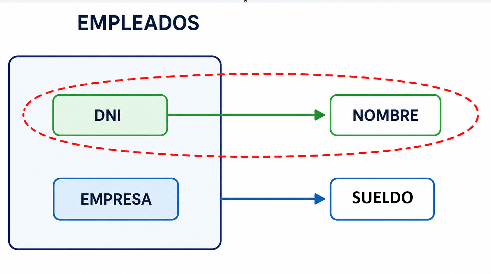
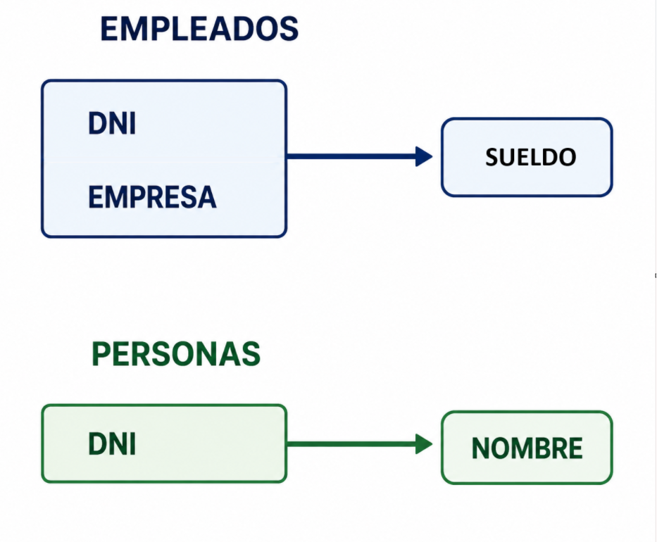

---
hide:
  - toc
---
# 4. Segunda Forma Normal (2FN)

Una relación está en Segunda Forma Normal (2FN) cuando:
<ul>
    <li>Está previamente en Primera Forma Normal (1FN).</li>
    <li>Todos los atributos que no forman parte de la clave dependen totalmente de la clave primaria.</li>
</ul>
Es decir, no pueden existir dependencias parciales respecto a una clave compuesta.

  
---  
  
Esta forma normal solo se considera si la clave principal es compuesta, y por tanto, está formada por varios atributos.

Si una tabla **T** tiene como atributos **A, B, C, D** y la clave es **A . B** cumpliéndose las dependencias:

**A . B** →**C**

**B** →**D**

Se observa que la tabla no se encuentra en 2FN ya que el atributo D no tiene una dependencia funcional total con la clave completa A . B, sino con una parte de la clave (B). El grafo de las dependencias funcionales sería:  

{ width=400 }

## Poner en 2FN

Para convertir una tabla que no está en segunda forma normal a 2FN, se realiza una proyección en dos partes:

### Parte A. Tabla principal

Se crea una **primera tabla** con la clave y todas sus dependencias totales con los atributos secundarios afectados:

{width=400}

### Parte B. Tabla de la dependencia parcial

Se crea una **segunda tabla** con la parte de la clave que tiene dependencias, y los atributos secundarios implicados:

{width=450}

!!!warning "Gráficamente"
    Si existe una flecha que sale del interior de la caja que engloba la clave, entonces la tabla no está en 2FN.

### Ejemplo aplicado

**Ejemplo**: Tabla con las personas que trabajan en diversas empresas con el sueldo correspondiente, con los atributos: **DNI, NOMBRE, EMPRESA, SUELDO**

Entre los atributos existen las dependencias:

**DNI** →**NOMBRE**

**DNI . EMPRESA** →**SUELDO**

**Grafo de dependencias**

{width=425}

**Grafo normalizado**

{width=300}

De manera que la representación de las tablas al **modelo relacional** quedaría de la manera siguiente:

!!! quote ""
    - EMPLEADO (<u>dni, empresa</u> sueldo)
    - PERSONA (<u>dni</u>, nombre)

