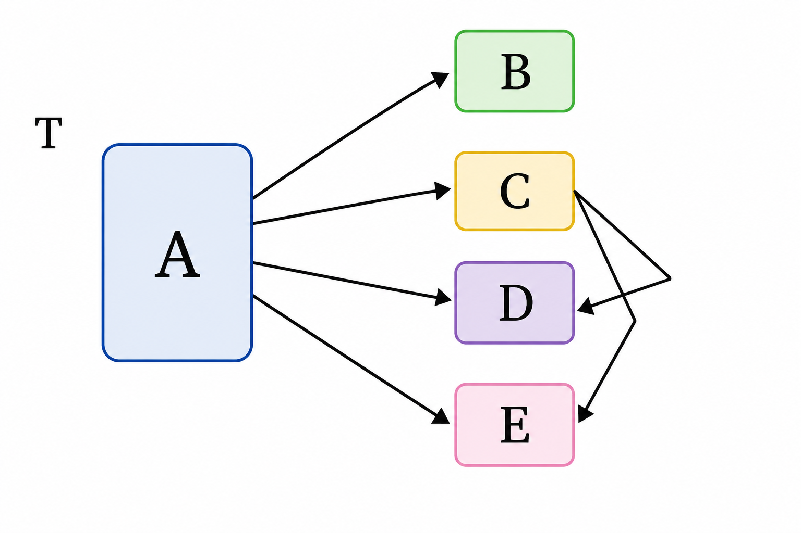
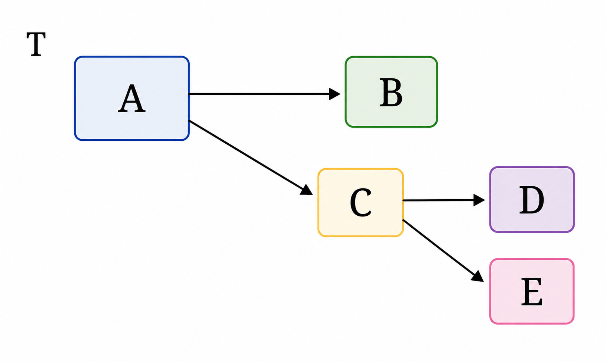
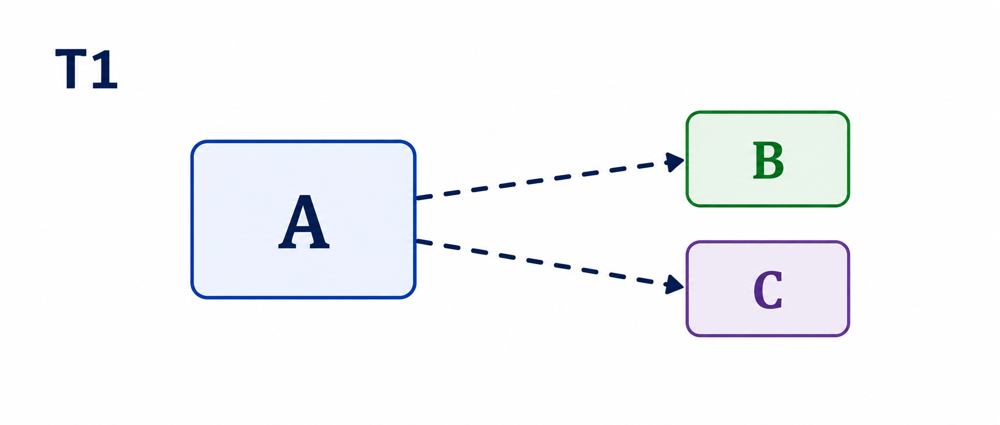
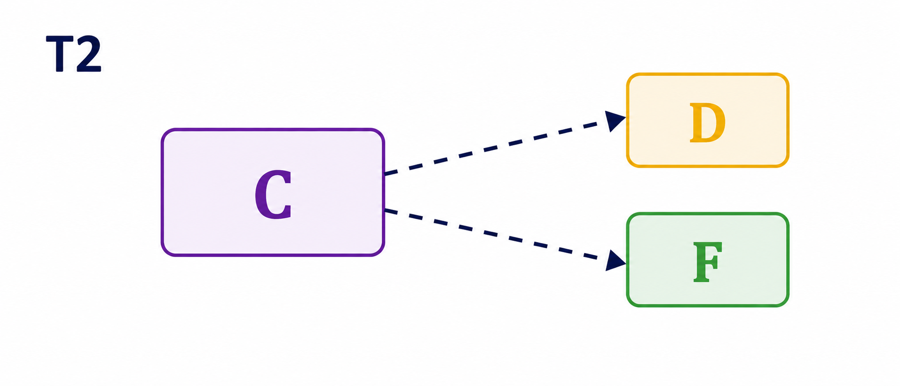
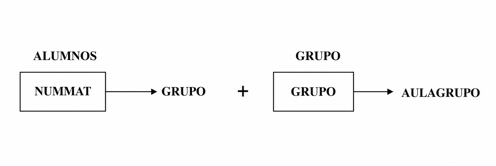
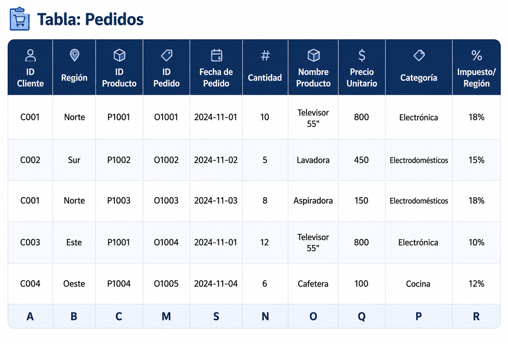
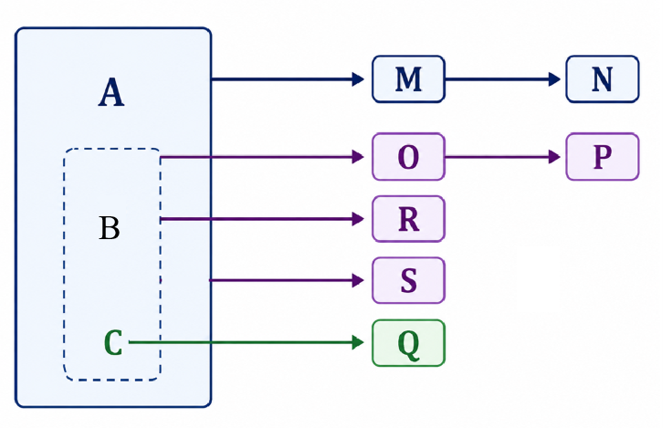
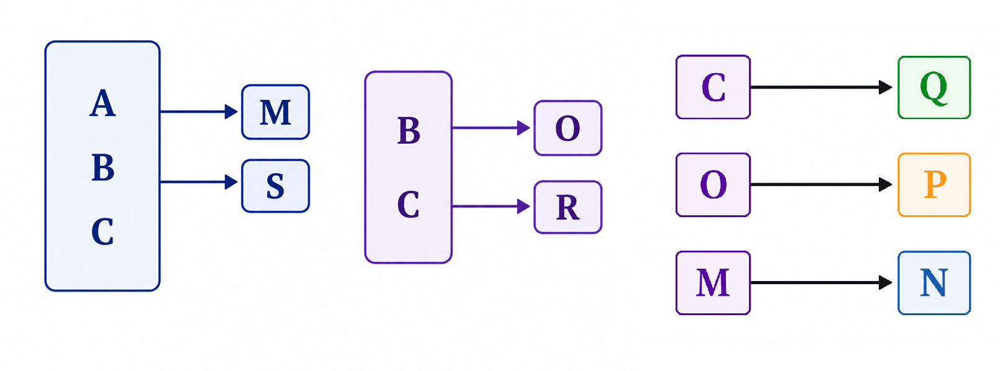

---
hide:
  - toc
---

# 6. Tercera Forma Normal (3FN)

Se dice que una tabla está en Tercera Forma Normal (3FN) cuando se cumplen dos condiciones:
<ul>
  <li>Se encuentra en 2FN.</li>
  <li>No existen dependencias transitivas.</li>
</ul>
  Es decir, ningún atributo no clave depende de otro atributo no clave.

  
---  
  
Esto significa que un atributo secundario solo puede depender directamente de la clave principal (o de una clave candidata) y nunca de otro atributo secundario. Si un atributo se obtiene a través de otro atributo no clave, existe una dependencia transitiva y la tabla no cumple la Tercera Forma Normal (3FN).

En un grafo de dependencias para comprobar la 3FN, solo se dibujan las dependencias entre atributos no clave, ya que las dependencias desde la clave hacia el resto de atributos se consideran implícitas.

**Ejemplo:** **A** es la clave principal, **B** es una clave candidata y se dan las siguientes dependencias:

**A** →**B B** →**A C** →**D**

**A** →**C B** →**C C** →**E**

**A** →**D B** →**D**

**A** →**E B** →**E**

El grafo queda del siguiente modo:  

**Opción 1**

{width=400}

**Opción 2**

{width=450}

Las flechas que muestran las dependencias funcionales que tiene la clave candidata B no se representan (como hemos dicho anteriormente) porque son evidentes y no simplifican la visión del grafo. Además, para la normalización, no se necesitan para nada; por el contrario, suelen complicar el análisis.

La tabla T no está en 3FN ya que los atributos D y E son transitivamente dependientes respecto de la clave A.

**<u>Poner en 3FN</u>**

Para normalizar una tabla que no esté en tercera forma normal, es decir, que tenga dependencias transitivas, descompondremos la tabla en más de una tabla:

**A)** Una **primera tabla** con la clave principal más los atributos que no dependen transitivamente

{width=400}

**B)** Una **segunda tabla** con los atributos que dependen transitivamente, más el atributo del que dependen, que será clave principal

{width=400}

Se hará una descomposición por cada dependencia transitiva que haya que afecte a campos distintos.

**<u>Ejemplo</u>**

Para el ejemplo de los atributos NUMMAT, GRUPO y AULAGRUPO tenemos el siguiente grafo:

{width=650}

Una vez descompuesta la tabla, según el algoritmo anterior, tendremos dos tablas, que si sen encuentran en 3FN:

{width=700}

De manera que la representación de las tablas al **modelo relacional** quedaría de la siguiente manera:

!!! quote ""
    - ALUMNOS (<u>nummat</u>, grupo)
    - GRUPOS (<u>grupo</u>, aulagrupo)

****

**Ejemplo del apartado 3.3**

A continuación, se presenta un ejemplo completo que ilustra cómo identificar las dependencias transitivas y normalizar una tabla a la Tercera Forma Normal.

{width=650}

**Grafo de dependencias**

{width=650}

La solución quedaría así:

{width=600}

{width=800}
