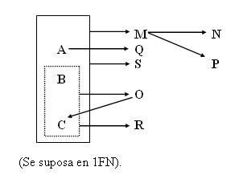
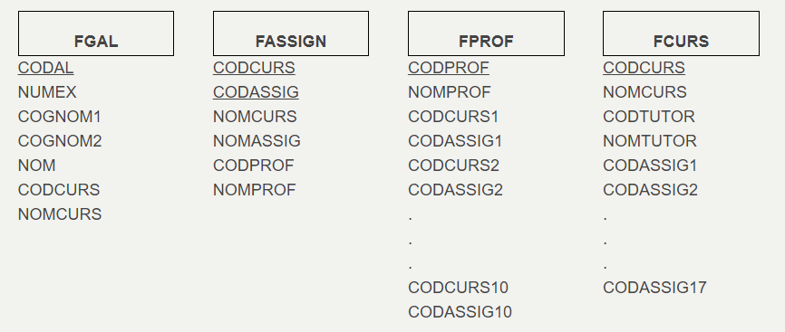
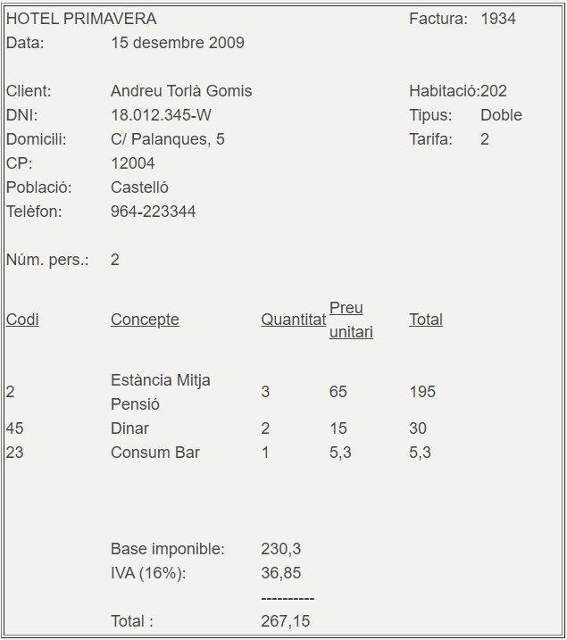
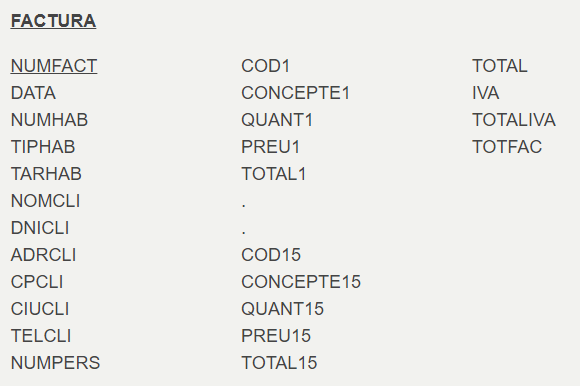

# Ejercicios

## 📝Ejercicio 1

Normalizar la tabla relacional que tiene como grafo de dependencias funcionales el siguiente:

Podéis normalizarlo todo directamente, sin tener que pasar primero por 2FN, 3FN y FNBC.

## 📝Ejercicio 2

En un Instituto tienen distribuida la información en los siguientes ficheros:

=== "T4_Ex_1"

	

=== "T4_ex_2"

	
  
Normalizad los ficheros, si los consideramos tablas de una Base de Datos. Debéis prestar especial atención a ver si está en 1FN.

## 📝Ejercicio 3

La factura de un hotel es la siguiente:

  
Si consideramos toda la información en una única tabla tendremos:

  
Intentad normalizarla. Prestad especial atención a ver si está en 1FN.

