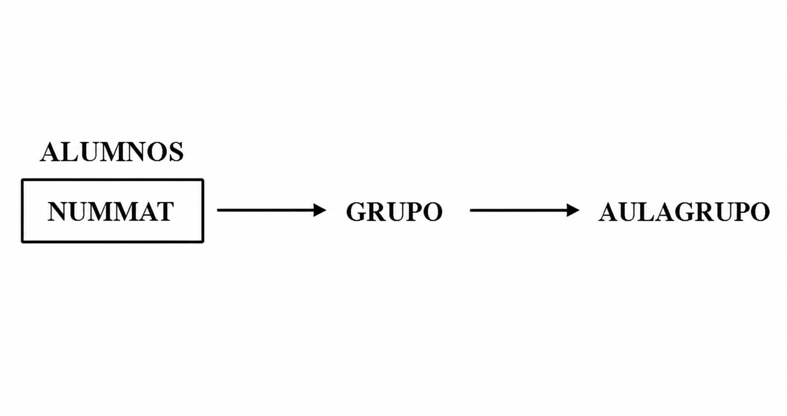
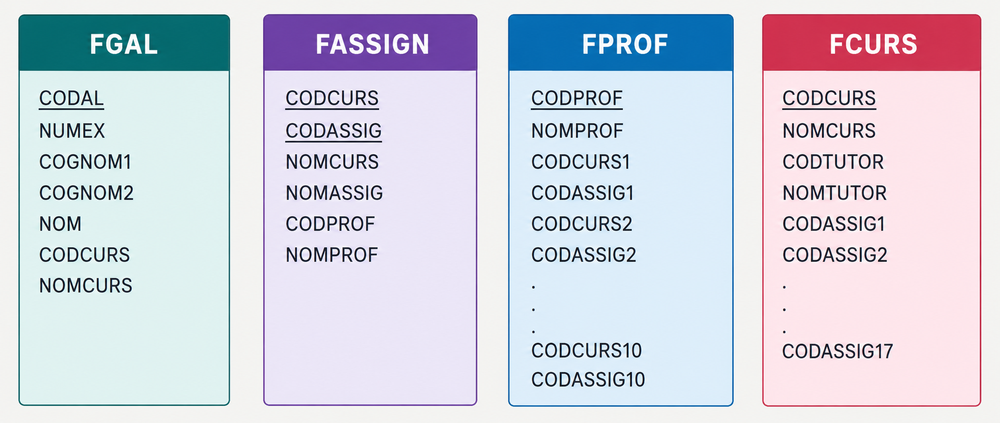

# Ejercicios

!!! tip "Revisa tu solución"

    Antes de consultar la solución oficial, revisa tu propuesta utilizando el prompt del apartado **[Cómo utilizar la IA para aprender](../IA.md)**.

	
## 📝Ejercicio 1

Normaliza la relación representada mediante el siguiente grafo de dependencias funcionales. Se supone que la relación se encuentra inicialmente en Primera Forma Normal (1FN).

{width=400}

## 📝Ejercicio 2

En un instituto, la información se encuentra distribuida en varios ficheros. Considerando cada fichero como una tabla de una base de datos, analizad su estructura y prestad especial atención a comprobar si cumple la Primera Forma Normal (1FN).

{width=500}
  
Normalizad 

## 📝Ejercicio 3

La siguiente imagen muestra la factura de un hotel y los campos extraídos de ella para almacenar la información. Prestad especial atención a comprobar si la tabla cumple la Primera Forma Normal (1FN).

  

    
  

  

    
  

