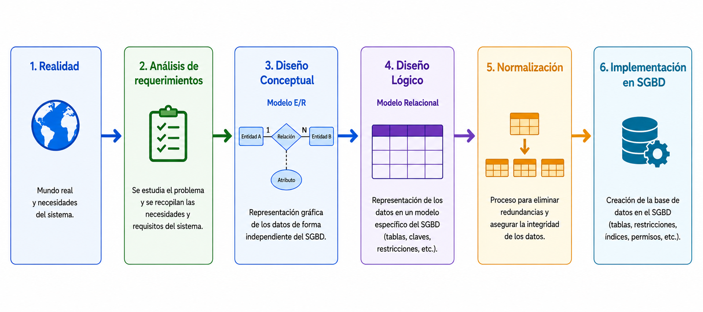

# Introducción al diseño de bases de datos

Cuando queremos crear una base de datos, no empezamos directamente haciendo tablas. Primero debemos analizar qué información necesitamos guardar, cómo se relacionan los datos entre sí y cómo organizarlos correctamente. Solo después podremos crear las tablas en un Sistema Gestor de Bases de Datos (SGBD).

## Fases del diseño

El proceso de diseño de una base de datos puede resumirse en las siguientes etapas:

??? info "Análisis de requerimientos"
    Se estudia el dominio del problema y se determina qué información debe gestionar el sistema.

    Actividades habituales:

    - entrevistar a usuarios y responsables
    - revisar procesos y documentos existentes
    - identificar reglas de negocio y restricciones
    - delimitar el alcance del sistema

    **Resultado:** catálogo de requisitos funcionales y de datos.

??? info "Diseño conceptual"

    Se construye una representación de alto nivel con el **modelo Entidad/Relación (E/R)**.

    En esta fase se definen:

    - entidades y atributos
    - relaciones entre entidades
    - cardinalidades y participación

    **Resultado:** diagrama Entidad/Relación.

??? info "Diseño lógico"

    El modelo E/R se transforma al **modelo relacional**.

    En esta fase se establecen:

    - tablas y atributos
    - claves primarias y foráneas
    - restricciones de integridad
    - ajustes derivados de la normalización

    **Resultado:** esquema lógico de la base de datos.

??? info "Implementación en el SGBD"

    Se materializa el diseño lógico en un SGBD.

    Tareas habituales:

    - creación de tablas y restricciones
    - definición de índices y vistas
    - carga inicial de datos
    - definición de usuarios y permisos

    **Resultado:** base de datos implementada y lista para explotación.

## Organización de este material

Aunque el diseño de una base de datos comprende varias fases, en este Resultado de Aprendizaje se aborda exclusivamente la fase de modelado. Esta se ha organizado en tres temas que siguen el orden natural del proceso:

- **Tema 1. Modelo Entidad/Relación (E/R):** modelado conceptual del problema y elaboración de diagramas.
- **Tema 2. Modelo Relacional:** transformación del modelo E/R a tablas y restricciones lógicas.
- **Tema 3. Normalización:** mejora del diseño relacional para reducir redundancia y evitar anomalías.

Cada uno de los temas puede consultarse de forma independiente accediendo desde el menú superior de la página, lo que facilita la navegación y permite acceder rápidamente al contenido deseado.

<!--
Acceso directo a cada bloque:

- [Modelo Entidad-Relación](Model_E-R/index.md)
- [Modelo Relacional](Model_Relacional/index.md)
- [Normalización](Normalizacion/1_introduccion.md)
-->

